##Car Climbing a Hill

One of aviation’s biggest misconceptions is that airplanes climb because of excess lift. "This is similar to believing that putting hand lotion in your airplane’s fuel tank will make your landings smoother, softer and younger looking".

__Airplanes climb because of excess thrust__, not excess lift. Let’s use my car as an example to see how thrust, not lift, is responsible for the climbing action of an airplane.

A car’s weight is offset by the upward push of the road on the tires. In effect, the road simulates the lift of an airplane’s wings. In other words, if the road were quicksand, there would be little upward push (lift) and the car would slowly be absorbed by this evil liquid. The lifting force acting at a 90 degree angle to the car’s motion (it’s the only way this lift can possibly act since the road pushes directly against the car’s tires). Weight, on the other hand, always acts downward toward the center of the earth.

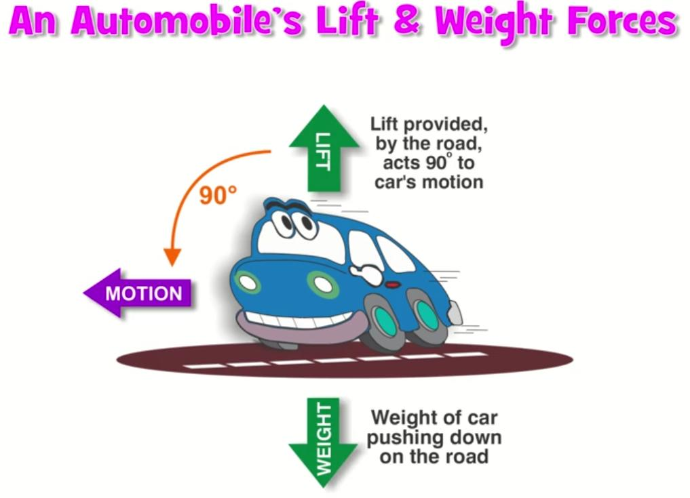{ .img-medium-large .img-center }

Now let’s allow the car to move up a hill (climb). The lifting force is still perpendicular to the road, thus 90 degrees to the car’s motion. Lift therefore is tilted rearward slightly, because the road is inclined upward. The total weight of the car, however, still acts directly downward. No matter how steeply the road tilts, weight will always point toward the center of the earth.

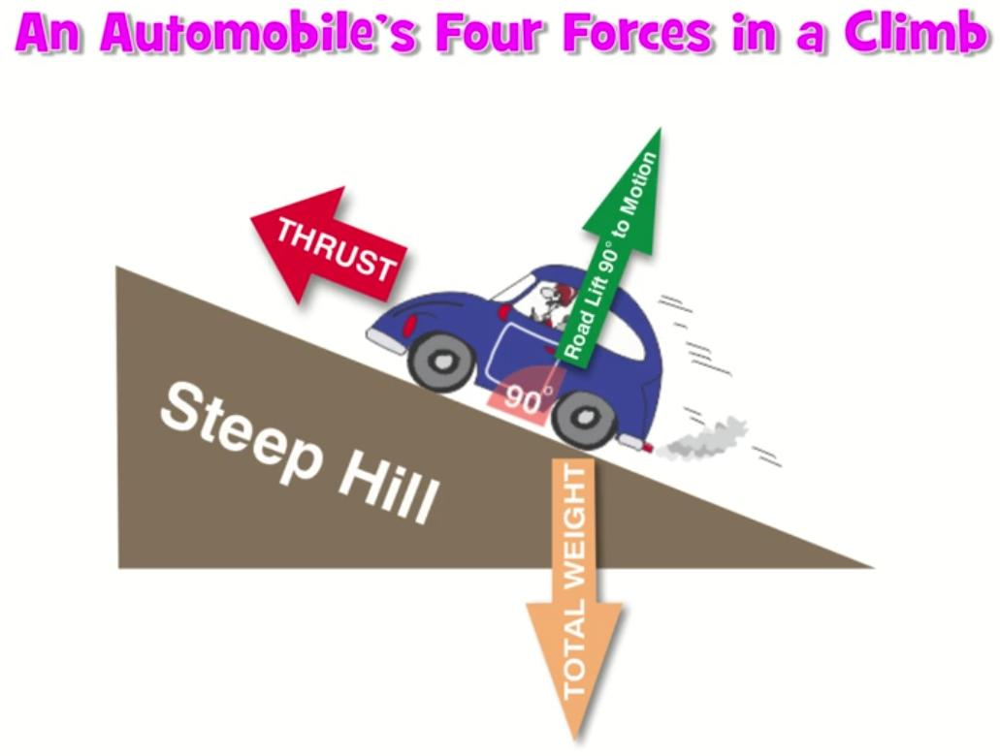{ .img-medium-large .img-center }

We can think of weight as two separate forces. Part of the car’s weight pushes on the road in a perpendicular direction. A smaller part acts rearward. Do you see what’s happening here? In a climb, some of the car’s weight starts acting rearward, in the direction of drag. Anything that pulls aft and impedes acceleration-even if it’s the car’s weight-acts like drag. The steeper the hill, the larger the rearward acting forces. Here’s what you’ve been waiting for: The upward push of the road on the car (arrow A) is equal to the car’s weight on the road. In other words, lift still equals weight, even in a climb. Part of the weight, however, now acts like drag, which really is a drag, because it gets added to the wind resistance. As we’ve already learned, thrust is the force that overcomes drag.

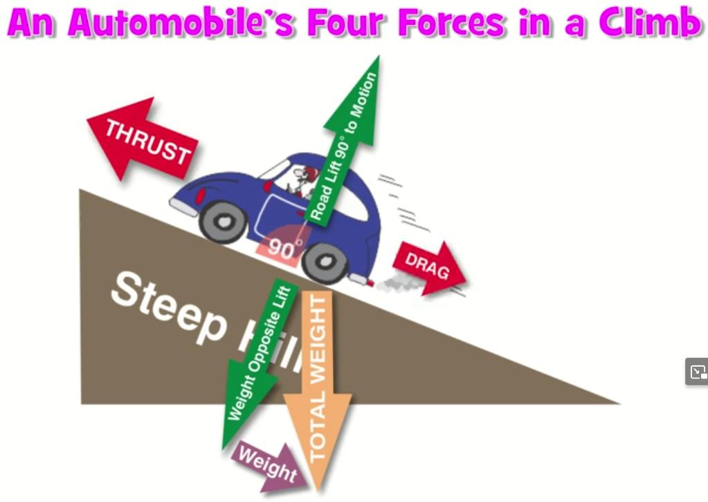{ .img-medium-large .img-center }

### Vector's tutorial

A single force can be a combination of smaller forces.

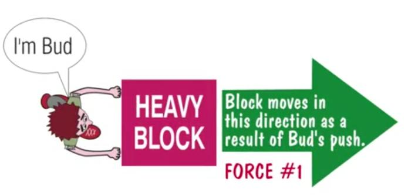{ width="300" }
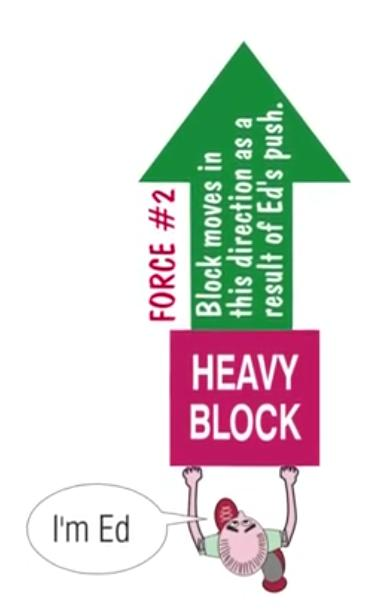{width="200" }
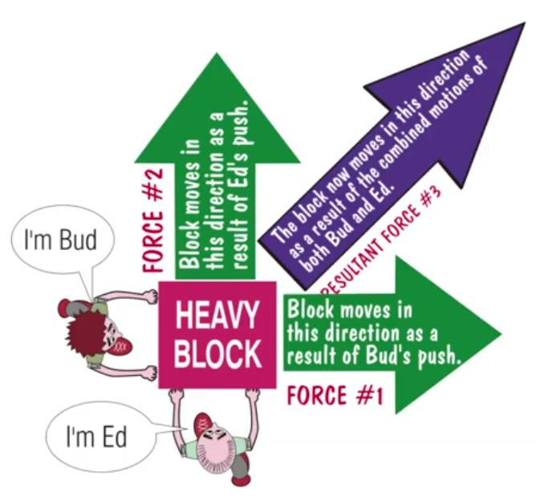{width="300" }

## Airplane Climbing a Hill

The forces acting on an airplane during a climb are similar to those of the car, the only major difference being that you (the pilot) choose the slope of the hill you climb. This is done using the elevator control in the cockpit (more on the elevator control later). As you can see, it’s excess thrust, not lift, that allows an airplane to climb. Given this very important bit of knowledge, you’ll now understand why smaller airplanes with limited power can’t climb at steep angles like the Blue Angels do at airshows. 

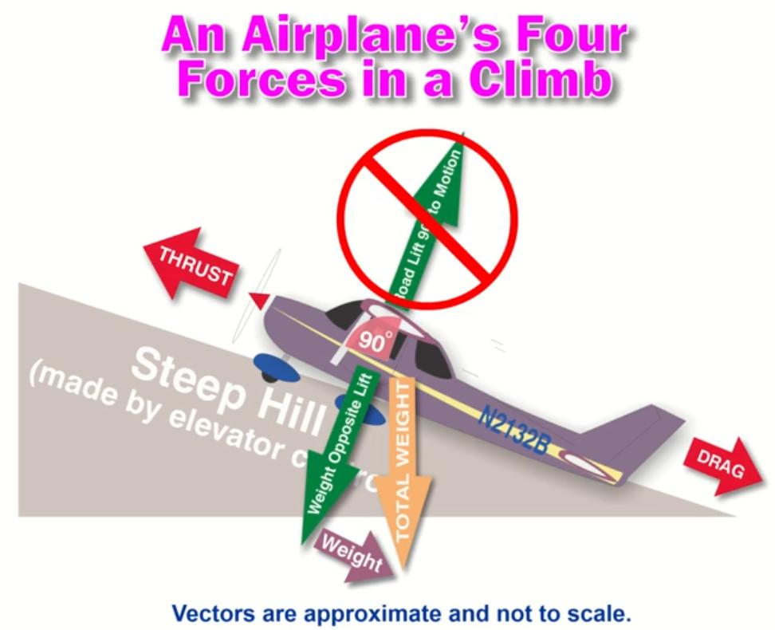{ .img-medium-large .img-center }

## Power & Climb Angle

Let’s go back to the automobile and climb a steep hill. The maximum forward speed of our car on a level road with full power is 65 mph. As we move up a hill our speed drops to 50 mph. An even steeper hill slows the car to 40 mph. The limited horsepower of the car’s engine simply can’t match the drag caused by wind resistance plus rearward-acting weight as the hill steepens, so the car slows. A bigger engine or redesign of the car to produce less wind resistance are the only options that will help.

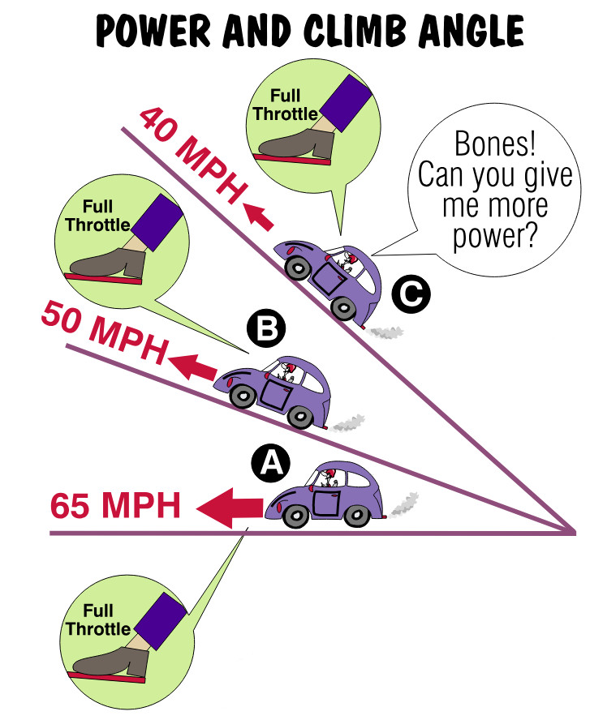{ .img-medium-large .img-center }

## Power, Climb Angle & Speed

The same analysis works, up to a point, for an airplane attempting to climb a hill in the air. Let’s say your airplane has a maximum speed of 120 knots in straight and level flight with full throttle. (Airplane throttles are hand operated. You push in for more power and pull out for less.) Applying slight back pressure on the elevator control points the airplane’s nose upward. This causes the airplane to climb a shallow hill. The speed decreases to 80 knots just as it did in the car. Attempting to climb a steeper hill slows our speed down to 70 knots. We can’t climb the hill we just selected faster than 70 knots because we don’t have the extra horsepower (thrust) to do so.

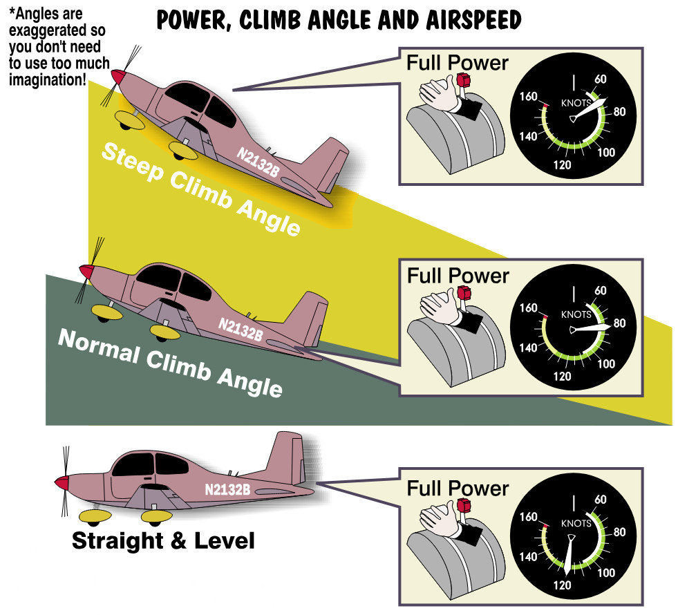{ .img-medium-large .img-center }

As we continue to steepen the angle of climb, our airspeed decreases further, just like the car’s speed did. Here, however, is where the airplane goes its own way. **Airplanes need to maintain a minimum forward speed for their wings to produce the lift required to stay airborne.**{.text-red} Ever wonder why airplanes need runways? Same reason long jumpers do. Airplanes and long jumpers must attain a certain speed before they can take flight. **This minimum forward speed is called the stall speed of the airplane**. It’s a very important speed that changes with variations in weight, flap setting, power setting and angle of bank. It also varies between airplanes (no need to worry because later I’ll show you how to recognize when you’re near a stall). As long as the airplane stays above its stall speed, enough lift is produced to counter the airplane’s weight and the airplane will fly.

If the stall speed of Airplane is 60 knots, then climbing at a slightly steeper angle will result in insufficient lift for flight. We call this condition a ***stall***. Need-less to say, these sounds make passengers reluctant to ever fly with you again. This is why some of your time as a student pilot will be spent finding out about stalls, and doing them (intentionally, that is). 
What you need to know is that airplanes with a lot of power (like jet fighters) can climb at steep angles; those with limited power, however, must climb at less steep angles. **Knowing it’s extra thrust and not extra lift**{.text-red} from the wings that is responsible for the climb allows you to draw some interesting conclusions. 

For instance, anything that causes the engine to produce less power prevents you from achieving your maximum rate of climb. Among the things resulting in less power production are high altitudes and high temperatures. More on these factors a bit later. At this point you should be asking an important question. I certainly don’t mean questions of the “Zen-Koan” type, such as “What is the sound of one cylinder firing?” or “If an airplane lands hard in the forest and nobody is there to hear it, does it really make a sound?” A good question for you to ask is, “How can I determine the proper size hill for my airplane to climb?” Let’s find out.

Airplanes have a specific climb attitude (steepness of hill) that offers the best of all worlds-optimum climb performance while keeping the airplane safely above its stall speed. You can determine the proper climb attitude for your airplane by referring to its airspeed indicator. With climb power applied (usually full throttle in smaller airplanes) the pitch attitude is adjusted until the airspeed indicates one of two commonly used climb speeds. These speeds are known as the ***best angle of climb*** or the ***best rate of climb*** airspeed. 

The ***best angle of climb*** provides the greatest vertical gain in height per unit of forward travel;

The ***best rate of climb*** provides the greatest vertical travel per unit of time.

You select ***best angle*** when you need to get up in the shortest possible distance, usually to clear an obstacle. You choose ***best rate of climb*** to gain the most altitude per minute. Let’s put this in concrete terms. Say there’s a concrete tower 750 feet high half a mile off the end of the runway. You definitely want to be above 750 feet at one-half mile out, and you don’t really care how long it takes you to get there, your choice is ***best angle of climb***. Under normal circumstances you will climb at the ***best rate of climb speed***, or a bit faster. Sometimes pilots climb at airspeeds slightly faster than the two reference airspeeds when better over-the-nose visibility is required. Raising the nose of the airplane results in a slower airspeed; lowering it picks up the pace. Where you place the nose-how steep you make the hill, determines what happens on the airspeed indicator. Unlike the ground-bound world, pilots decide how steep the hills in the air are going to be (within limits of course!). With just a little experience, you’ll be able to determine the correct size hill (nose-up attitude) by simply looking out the front window instead of having to rely solely on the airspeed indicator. When I was a student, any specific airspeed was the one place on the dial where the pointer never went. I was not gifted with much coordination as a youngster. 

## Cars and Descents

While engine power moves a car uphill, gravity pulls it down. Without your foot on the throttle, the car’s downward speed is determined by the steepness of the hill it’s descending (Figure 8). The steeper the hill, the faster it goes. If the hill shallows out, then the speed decreases. If the hill becomes too shallow, then some power is necessary to maintain sufficient forward speed.

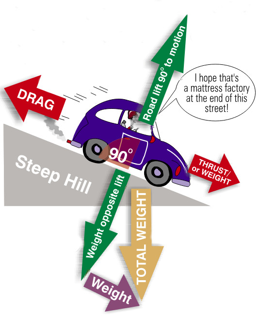{ .img-medium-large .img-center }

## Airplanes and Descents

Airplanes can also move downhill without power. Just lower the nose and you’ll get what appears to be a free ride (it isn’t, but let’s not get into that ). You can adjust the nose-down angle with the elevator control and descend at any (reasonable) airspeed you desire. You now have the answer to a question I guarantee every first-time passenger will either ask or want to ask you: “What happens if the engine quits?” The airplane becomes a glider, not a rock. Unlike climbing, you may elect to descend within a wide range of airspeeds. There are, however, many factors to be considered such as: *forward visibility, engine cooling and the structural effects of turbulence on the airframe*.

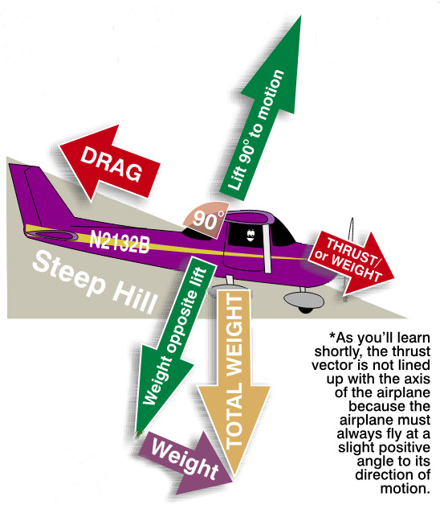{ .img-medium-large .img-center }

However, during the last portion of the landing approach (known as final approach), you should maintain a specific airspeed. Usually this speed is at least 30% above the airplane’s stall speed.When preparing to touch down, excess airspeed or erratic control forces often lead to difficulty in making a smooth landing (it’s also the reason pilots make good humored fun of one another). Now that **The Four Forces** are no longer a mystery, let’s examine the most important force: ***Lift***. Without this force, airplanes are nothing more than very expensive ground bound vehicles that are impossible to parallel park.