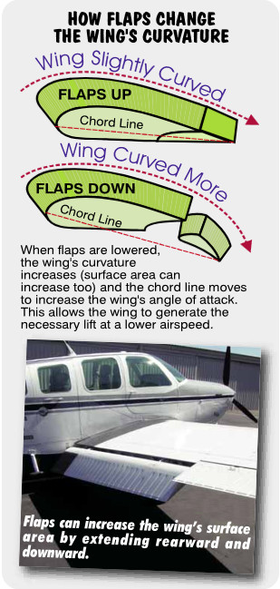
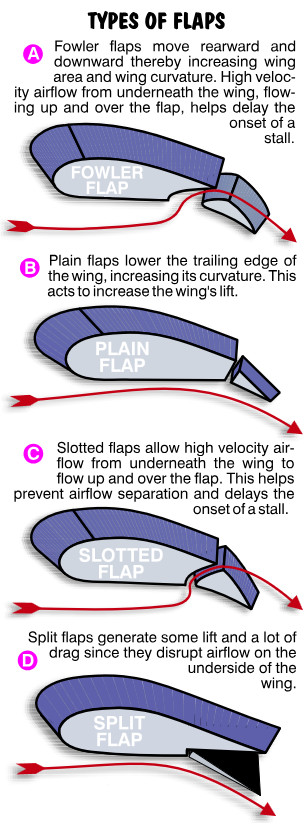
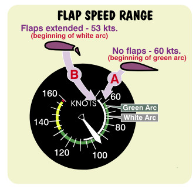

## Flaps

### Flap over Flaps
   
Ever wondered why the wings of large commercial airplanes sprout aluminum prior to takeoff and landing? Fast airplanes require small, thin wings to achieve the eye-popping velocity needed to satisfy today’s speed-hungry air traveler. The problem with thin, small wings is that they stall at a very high speed. Most jet airliners would have to take off and land at close to 200 MPH to achieve a safe margin above stall, if they couldn’t enlarge their wing’s surface area and change their camber to create a temporary low speed wing. Engineers, however, design wings to do just that by supplying them with flaps. Extending or retracting flaps changes the wing’s lift and drag characteristics.

Lowering flaps lowers the trailing edge of the wing. The wing’s lift is increased in two ways. First, the lowered trailing edge increases the angle the chord line makes with the relative wind. Greater lift results from this increased angle of attack. Second, the lowered trailing edge increases the curvature on part of the wing resulting in increased air velocity over the wing’s upper surface (many flaps even increase the wing’s surface area by extending downward and outward). Because of the larger angle of attack and greater curvature, flaps provide you with more lift for a given airspeed.

In case you haven’t noticed, this is also why flight control surfaces (ailerons, rudders and elevators) work. They change the curvature of the surface to which they are connected. This changes the lift produced by that surface.

{ .img-medium-large .img-center}

### Flap varieties

Flaps come in several varieties. They all serve two basic purposes: to increase lift and drag. **Fowler flaps** (A) extend downward and backward. This provides a nice addition to wing curvature as well as increasing the surface area of the wing. Fowler flaps also provide the greatest increase in lift with the smallest change in drag. When extended this flaps provide the greatest change in pitching moment. Fowler flaps are common on smaller single engine Cessnas like the C-150, C-152, C-172 and C-182. 

Other varieties of flaps, like the **Plain type** (B), offer an increased wing curvature without an increase in the wing’s surface area. Plain flaps are found on airplanes like the Grumman American Yankee trainer. 

**Slotted flaps** (C), increase curvature of the wing and add fast moving air to the trailing edge of the wing. They produce much more lift than either the plain and the split flap (fast moving air helps prevent burbling and airflow separation which results in a stall). This types of flap is typical on airplanes like the Piper Warrior and Piper Archer. 

**Split flaps** (D), increase the impact energy under the wing, thereby adding to the wing’s lift (this impact energy results from the barn door lift we previously discussed). These flaps also add a great deal of drag to the wing. Unlike fowler flaps, extending split flaps creates the least change in pitching moment. Found on airplanes like the Cessna 310, 

{ .img-medium-large .img-center}

### Why Use Flaps

What’s the reason for putting flaps on small airplanes? First and foremost, they create the lift necessary to maintain flight at slower airspeeds. When landing, your goal is to approach and touch down at a reasonably slow speed. You certainly don’t want to touch down at cruise speed. Such a high speed landing might just turn your tires into three little puffs of smoke. Flaps allow you to approach and land at a slower speed while maintaining a safe margin above the stall speed. A slower speed on touchdown means less runway is used to stop. This is an important consideration if the runway is short. Alternatively, if the wind is gusty, you might consider approaching with little or no flap extension. At the slower speeds allowed by flaps, the airplane becomes more difficult to control (the controls are not as responsive). Let’s see how effectively the flaps increase lift by referring to the airspeed indicator. Since many flaps are painted white (we’ll assume they are for this discussion), the airspeed indicator’s white arc represents the flap operating range.

{ .img-medium-large .img-center}

The beginning of the white arc (B) is known as the power-off, full-flap stalling speed (in nonaccelerated flight at the airplane’s maximum allowable weight). It’s the speed at which the airplane stalls with flaps fully extended, power off and the gear extended. The airplane will fly when the airspeed and the wind blowing over the wings is above the minimum value indicated by the lower end of the white arc, provided it is below the critical angle of attack. The high speed end of the white arc is the maximum speed you may fly with flaps fully extended. Flying beyond this speed can damage the flaps. 

You will notice that the white arc (B) begins at a speed seven knots slower than the green arc (A). From an earlier discussion, we learned that the green arc is the power-off stalling speed with flaps retracted (gear retracted too). An airplane must be flying faster with  more wind flowing over the wings to fly with flaps retracted. With flaps fully extended, you can touch down at a slower speed, before flap stall speed on the airspeed indicator, assumes the airplane is at its maximum allowable weight.

In other words, you don’t get something for nothing. Flaps provide you with lift but they also produce drag. Full flaps create a very low speed wing. Try to accelerate it and at some point, drag defeats your efforts. Fortunately, the first half of flap travel usually provides more lift than drag. The last half usually provides more drag than lift. This is why some aircraft manuals recommend only 10 to 25 degrees of flaps for takeoffs on short fields (usually one or two notches on a three to four notch, manual flap system).

If you’re high while on approach to land, you can select full flaps to increase the airplane’s drag. It’s considered normal to use flaps only when descending within the traffic pattern and not when descending from cruise flight. After all, cruise flight descents are efficient and fast at higher speeds where the parasite drag is greater. If you wanted to descend with flaps from cruise flight, you’d have to slow the airplane down below maximum flap extension speed (the top of the white arc), before applying flaps. This would be cumbersome. The airplane can descend faster at cruise speed with reduced power while getting you to your destination sooner.

Since flaps provide more lift at slower speeds, think carefully about how and when they are retracted while airborne. If you’re making a full flap approach and it’s necessary to go around (i.e., give up this approach, climb, and return for another landing attempt), don’t retract the flaps all at once! This would be like having someone remove a part of your wing at a slow speed. The sudden and often dramatic increase in stall speed could place you near a stall before you can accelerate to a safer speed. Apply full power first, then retract the flaps in increments. In airplanes with 30 to 40 degrees of flap extension, retract the flaps to their least-drag/maximum-lift position. Usually, this position is found at one-half flap travel (depending on the airplane). In airplanes with three notches of manually applied flaps, retract one notch first, followed by the other two once the airplane begins to accelerate.

