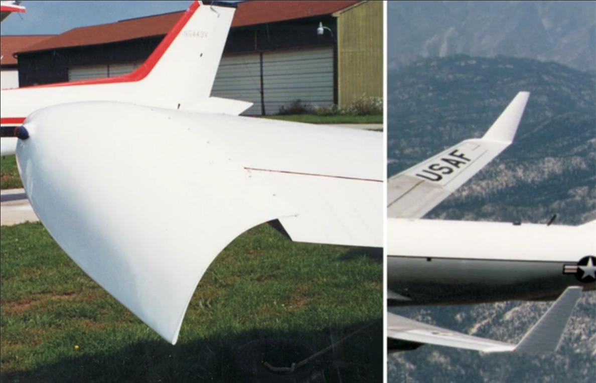
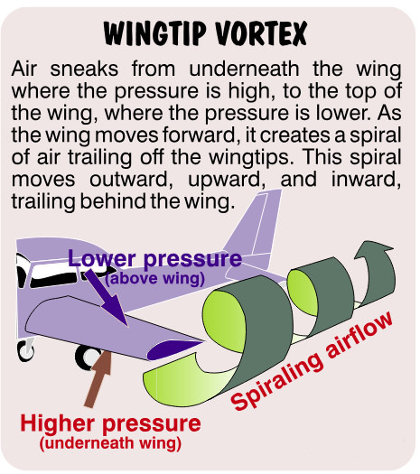
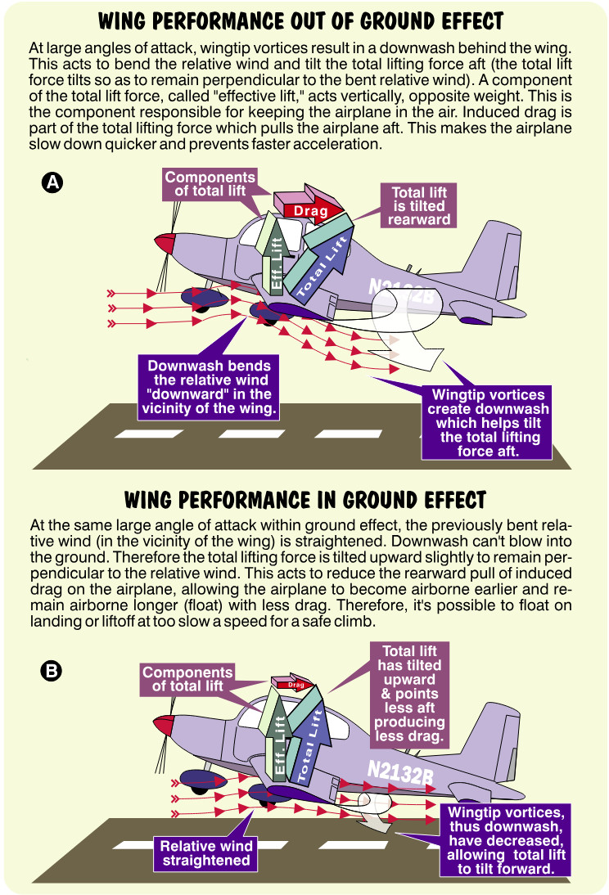
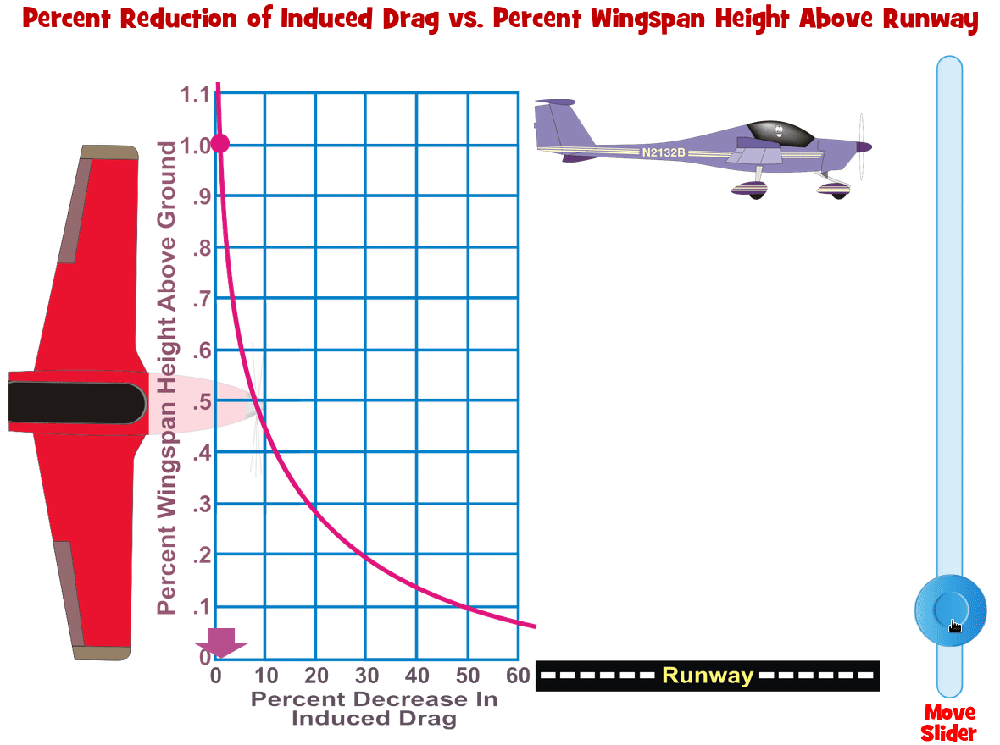

## Ground Effect

Is it possible to unbend the air which is bent by the wing at a large angle of attack? Yes, using the wizardry of something called ***ground effect.***
Ground effect allows an airplane flying close to the runway to remain airborne at a slightly lower-than-normal speed. During landing, this means the airplane might have a tendency to float (continue to glide just above the runway). During takeoff, the airplane can become airborne before it has sufficient speed to climb. Either event is like buying new glasses, taking them back because you can’t read, then finding out you’re illiterate. Both cause a lot of chagrin, but a takeoff like this can be dangerous. To understand how ground effect affects an airplane, you need to know something about how wind tries to escape around a wing.

### Winglets

Remember that a wing generates lift because of increased pressure on its lower surface and de-creased pressure over its upper surface. At high angles of attack, this pressure differential is quite large. Large pressure differences cause air molecules to act like lots of little prison inmates, with each molecule waiting for the slightest chance to break out of jail. Given that chance, air molecules underneath the wing would gladly sneak over the top, where lower pressure resides. This reduces the wing’s lifting efficiency.  Unfortunately, it’s difficult to design wings that preclude this escape.

Drooped wingtips are a common sight on many airplanes. They create a barrier to help contain escaping high pressure air from under the wing. Winglets are another common sight on larger airplanes. They also create a barrier that minimizes the escape of under-the-wing, high pressure air. Since they bend upward, they also give the impression that the airplane attempted to taxi between two closely parked gas trucks.

{ .img-medium-large .img-center}

### Wingtip Vortex

Air sneaking from under the wing spirals upward and over the wingtip. Couple this spiral with air moving backward over the wing and you get a vortex similar to a horizontal tornado. Called a ***wingtip vortex,*** this tornado spirals outward, then upward, then inward behind each wing. You can expect this vortex action to increase at large angles of attack, where the pressure differential between the top and bottom of the wing is greater.

{ .img-medium-large .img-center}

### Induced drag

If these vortices only affected the air at the wingtips, aerodynamicists would have many fewer design problems. Unfortunately, not only does this vortex spiral around the wingtips, it also adds a downwash or downward flow to the air behind and along the wing’s span as shown by Airplane A. The wing itself also thrusts air downward. At higher angles of attack this results in the downward bending of the relative wind in the vicinity of the wing. This newly bent relative wind is often called the ***local relative wind.*** Recalling that lift is always perpendicular to the relative wind, the total lift now tilts rearward slightly. It does so to remain perpendicular to the newly bent relative wind. Part of the total lift is now acting in a rearward direction. This results in an increase in induced drag at high angles of attack.

{ .img-medium-large .img-center}

When the wing moves close to the ground (usually within one wingspan’s length or less), its vortices, thus its downwash, diminish. In other words, the downwash can’t shove the air into the ground. Voila, the local relative wind in the vicinity of the wing unbends as shown by Airplane B. This has the effect of allowing the wing’s total lifting force to tilt upward slightly, despite the wing’s large angle of attack. An upward tilting of the total lifting force means the airplane experiences less induced drag (less rearward pull of lift). The net result is that it takes less power to produce the necessary lift for flight while in ground effect.

(See Road MAchado's video: Relative Wind and Induced Drag.)

### Ground Effect Caution

Attempting to emerge from ground effect before the plane is really ready to fly is like a newly hatched butterfly taking off before its wings are dry. It’s not going to work. Trying to climb out of ground effect at this slower speed can cause the airplane to sink back onto the runway (if there’s any runway left to sink back to at this point!). You must reach the airplane’s minimum climb speed before charging out of ground effect. Because of the rather large reduction in induced drag, ground effect can also cause the airplane to float during landing. Higher approach speeds make this particularly noticeable. Certainly this isn’t much of a problem if you’re landing at the Bonneville Salt Flats (don’t try it). If, however, you’re landing on a 1,000 foot strip and approach at excessive speed, you might need a contractor’s license (you’ll need it to rebuild all the houses, fences and sheds at the runway’s end). Here’s a big secret. If you’re approaching at a speed above the normal approach speed, slow down before entering ground effect. Since ground effect becomes noticeable at a wing span’s length and exists until touchdown, slow the airplane to the manufacturer’s recommended approach speed before reaching this height. Continue your descent at this speed.

### Pitch Changes In and Out of Ground Effect

As if floating on landing and an inability to climb after takeoff aren’t enough of a problem, expect to experience subtle pitch changes when entering or leaving ground effect. As the airplane becomes airborne and flies out of ground effect, the wing’s downwash increases. This bl ows air downward on the tail as shown by Airplane A. It’s possible to become airborne without sufficient speed, then attempt to climb and have the nose pitch up slightly. This is the last thing you want to happen when the speed is low. If you’re not prepared for this, it will be an unhappy surprise (and pilots don’t like surprises!).

During landing, as the airplane enters ground effect and the downwash diminishes, the nose tends to pitch forward. If you are not prepared for this you might land suddenly or sooner than expected. The secret to managing ground effect is to anticipate it. Expect ground effect to increase when the airplane is within a wing span’s height above the runway. Low wing airplanes experience more ground effect than their high wing cousins. Be prepared for a slight nose-up pitch during takeoff and a slight nose-down pitch when landing.

{ .img-medium-large .img-center}