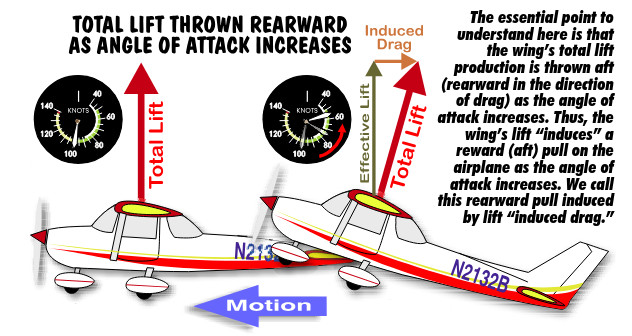
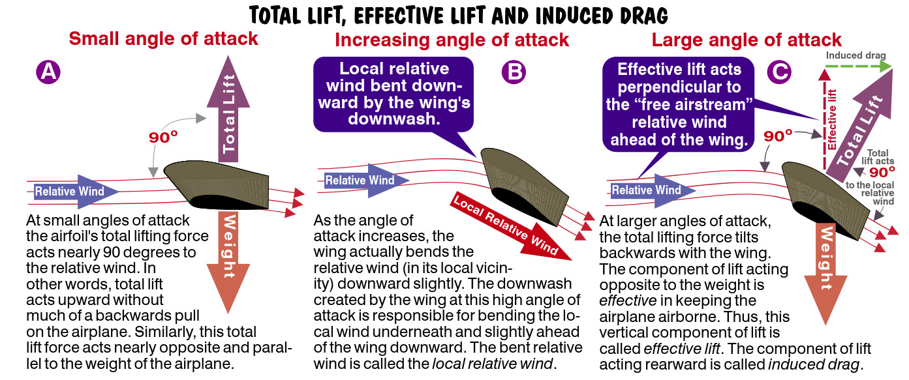
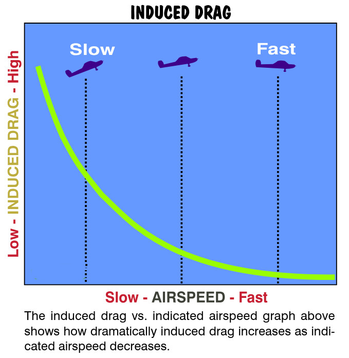

## Induced Drag

People can sometimes be induced to act in an unfortunate way. This occurs when a TV commercial recommends that you purchase a do-it-yourself acupuncture kit. After a little experimentation, you discover that you don’t feel any better but your body is capable of picking up cable TV. Well, wings aren’t people, but sometimes they induce the lift they produce to act in unfavorable ways. In particular, wings can induce their total lifting force to act rearward instead of in an upward direction. Remember, ***any force acting rearward on the airplane acts like drag***. (At this point I’ll offer you a choice. You can either believe me when I say that induced drag increases when the airplane slows down or you can plow through the following few paragraphs and I’ll prove it to you. Most pilots can and do fly safely without knowing the nuances of drag formation.)

{ .img-large .img-center}

Time for another experiment (yes, back to the car again). Stick your hand (and only your hand) out the window as you’re moving. Hold your hand parallel to the relative wind so that it has little or no angle of attack. You should feel little or no lift and relatively little rearward drag. Now, increase the hand’s angle of attack. Notice how your hand wants to rise (we call this *lift*) but it also wants to move rearward slightly (we call this *drag*). As the hand’s angle of attack increases, the local relative wind in the vicinity of the hand is bent downward slightly. Earlier we learned that lift acts perpendicular to the relative wind. Therefore, the total lifting force is tilted rearward as the hand’s angle of attack increases. A further increase in the hand’s angle of attack increases the upward and rearward pull of the total lifting force.

Here’s the point. *The total lifting force acting on the hand pulls it upward and backward as the angle of attack increases.*  The upward, or vertical portion of the total lift force works against the airplane’s weight to keep it aloft. The rearward pull of the total lifting force acts in the direction of drag; we call it *induced drag.* 

Although hands are much less sophisticated in generating lift than are wings, there are similarities between them.

{ .img-large .img-center}

Wing A is at a low angle of attack. Its total lifting force is nearly perpendicular to the relative wind and acts nearly opposite the airplane’s weight, in other words straight up.
As Wing B’s angle of attack increases, downwash from the wing bends the relative wind slightly in advance of the moving wing. The total lifting force tilts aft so as to remain perpendicular to the newly-bent, *local relative wind* as shown by Wing C. We can take the portion of the tilted lift force acting straight up, opposite the airplane’s weight, and call that component the ***effective lift.*** It’s the part that’s effective in keeping us airborne and it acts opposite the airplane’s weight. This effective lift also acts at a 90 degree angle to the undisturbed relative wind ahead of the airplane. 

The horizontal portion of the tilted lift force, however, acts rearward, in the direction of drag. We call this rearward pull ***induced drag.*** Obviously, when the angle of attack is small, the total lifting force acts in more of an upward or vertical direction with little rearward pull on the airplane. 

### Induced Drag Curve

As the angle of attack increases, the drag induced by the rearward component of total lift also increases. Consequently, when the airplane slows, the angle of attack increases and induced drag increases. As the airplane’s speed increases, the angle of attack decreases and the induced drag also decreases.

{ .img-medium-large .img-center}

