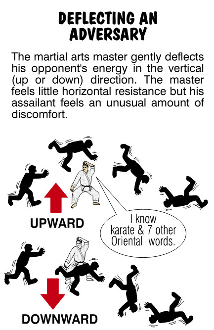
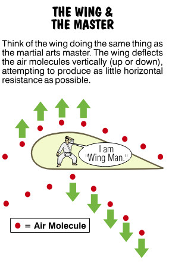
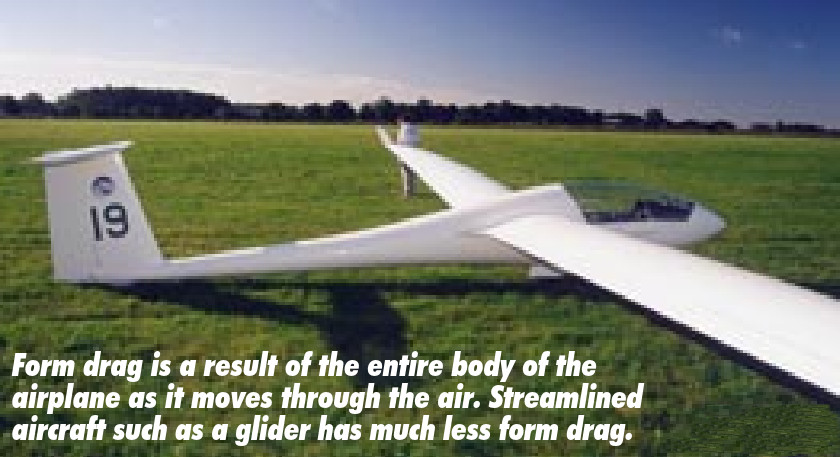
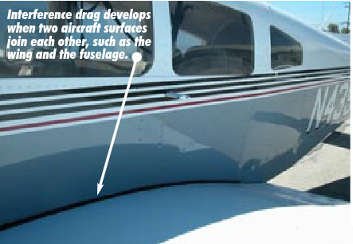
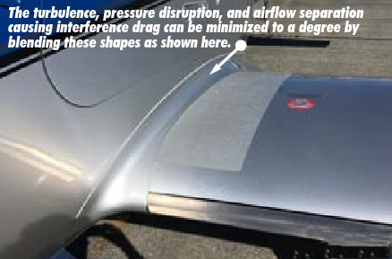
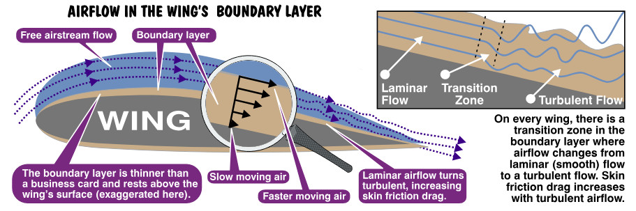
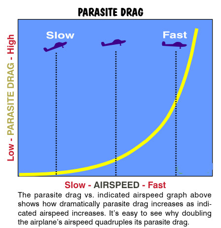
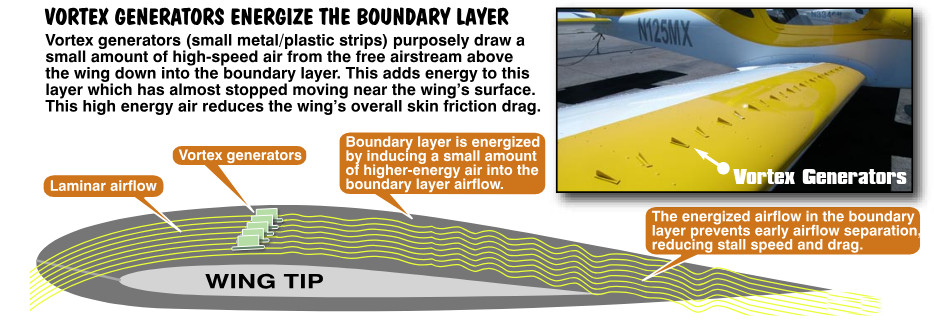

## What a Drag

You can’t get something for nothing in aviation. Although Burt Rutan (a famed airplane designer) comes close, there is no free lunch when it comes time for an airfoil to pay for the lift it develops. Drag is that price. 

Drag is the natural response to an object’s movement through the air. Try an experiment. Stick your head out a moving automobile (amazing what you can learn about flying while sticking parts of you out a car window). At 60 miles per hour (MPH) your mouth puffs open, your eyes bug out, your head is thrown back and your hair looks like it was blow dried with a Pratt & Whitney jet engine. You look like a rock star! This is all the result of the wind resistance known as drag.

## Horizontal and Vertical Movement of Air

An Aikido martial arts master is trained to deflect his adversary vertically without offering any resistance in the horizontal direction. Upon encountering a head-on adversary, the Aikido master makes the Bruce Lee karate call sound and gently deflects the assailant either upward or downward.

{ .img-medium-large .img-center}
{ .img-medium-large .img-center}

Wings do something very similar. They are designed, as you will recall from our earlier discussion, to deflect air vertically while offering very little horizontal resistance. Regardless of how efficient the wing is, some horizontal resistance to forward motion is always present. We discussed drag briefly at the beginning of this chapter, but let’s take a somewhat closer look at the two kinds of speed retardant ***parasite drag and induced drag***.

Drag is a very complicated subject. I’ve seen both blood and entire pots of coffee spilled over the lurid details of a subject so arcane that even engineers with multiple degrees disagree. For the moment, what you need to know is that there are two kinds of drag. ***Parasite drag is the result of friction***. Trying to move something through the air results in friction with air molecules. This resistance isn’t useful and that’s why it’s called parasite drag. It’s there because it’s there. Hang on to the idea that as airspeed doubles, parasite drag quadruples, and there’s very little  you can do about it. Rats!

***Induced drag is resistance to motion induced by the wing turning some of its lift into drag.*** What you need to know here is that induced drag does the complete opposite of parasite drag, it increases as the airplane slows down.

## Parasite Drag

The following three types of drag fall under the category of **parasite drag**.

*Form drag* is that portion of parasite drag that’s generated by the shape of the airplane and the flow of air around it. The fact is that no matter how sleek, skinny or slick you make an airfoil, it still generates parasite drag because air must flow over, under, and around it. Wings, antennas, the engine cowling, wheel pants, and so on all generate form drag. The degree of form drag present depends on how quickly and smoothly the displaced air rejoins itself after displacement.

{ .img-medium-large .img-center}

*Interference drag* results from the eddy currents and turbulence created when airflow from different surfaces interact. For instance, air flowing over the fuselage interferes with air flowing over the wing generating a small degree of turbulence as a result. This disruption of the airflow creates drag. The most interference drag, for example, is created when two perpendicular surfaces meet, such as the fuselage and the wing. Of course, fairings (blending of metal shapes) reduce interference drag. Separating lifting surfaces and external airplane components also helps reduce interference drag.

{ .img-medium-large .img-center}
{ .img-medium-large .img-center}

*Skin friction drag* results from the aerodynamic resistance that occurs when moving air contacts an airplane’s surface. You can spend all day dusting and polishing your airplane but there will always—always—be some skin friction drag present, no matter how smoothly you polish your bird. Why? Because no surface is perfectly smooth. Air molecules that have direct contact with the wing’s surface become essentially motionless, which is quite undesirable. Ideally, we want those molecules touching the surface to flow without any resistance. That, however, can’t happen given that any surface, no matter how smooth it is, is still rough on a molecular scale. So skin friction drag is always present, but it can be minimized to a degree by using flush-mounted rivets, reducing surface irregularities, and keeping the airplane’s surfaces cleaned and waxed. 

By moving away from the wing’s surface, the layers of air molecules move slightly faster (See figure below.) until these molecules move at the free airstream velocity (the unrestricted flow of air over the airplane). Engineers refer to the layer of air in contact with and just above the airfoil surface as the ***wing’s boundary layer***. This layer of air is surprisingly thin, perhaps about as thin as a business card. Ultimately, the actual speed of the air molecules flowing over a wing depends on the shape of the wing, the viscosity (stickiness) of the air, and the air’s compressibility (how much it can be compacted).

{ .img-large .img-center}

## Parasite Drag Curves

It turns out that the airflow above the boundary layer reacts to the shape of the top of the boundary layer just as it would react to any solid object. This results in the wing’s boundary giving this airflow an “effective” shape that can be slightly different from the wing’s shape. That, of course, would be a problem if engineers didn’t consider how this “effective” airflow shape might interfere with such things as the ram air input to the pitot tube or fuel tank vent lines. Of course, the wing’s boundary layer might also become detached from the wing. When this happens, drag increases dramatically and the wing stalls. The accumulative effect of all three forms of parasite drag is seen in the next graph.

{ .img-large .img-center}

The most desirable type of airflow to have over the top of the wing is ***laminar*** airflow. This is smooth, high-speed air that produces relatively little skin friction drag. Some airplanes with laminar flow wings can maintain laminar airflow over half of the wing’s upper curved surface. Most airplanes, however, lose the laminar flow of air at a point where the wing’s center of pressure is located (25% to 30% aft of the leading edge). At this point, pressure begins increasing, resulting in a loss of energy and an increase in drag. To help prevent early airflow separation, engineers add vortex generators to the top of the wing which creates small vortices (thus, the word, “vortex”). These small vertical strips mix high-energy air from the free airstream above the wing’s boundary layer with airflow in the wing’s boundary layer. The result is higher-speed airflow near the wing’s surface. While this airflow isn’t laminar, it does resist early airflow separation over the wing, **reducing the airplane’s stall speed and skin friction drag**. This is one reason why STOL (Short TakeOff and Landing) airplanes often have vortex generators on their wings and tail surfaces.

{ .img-large .img-center}

