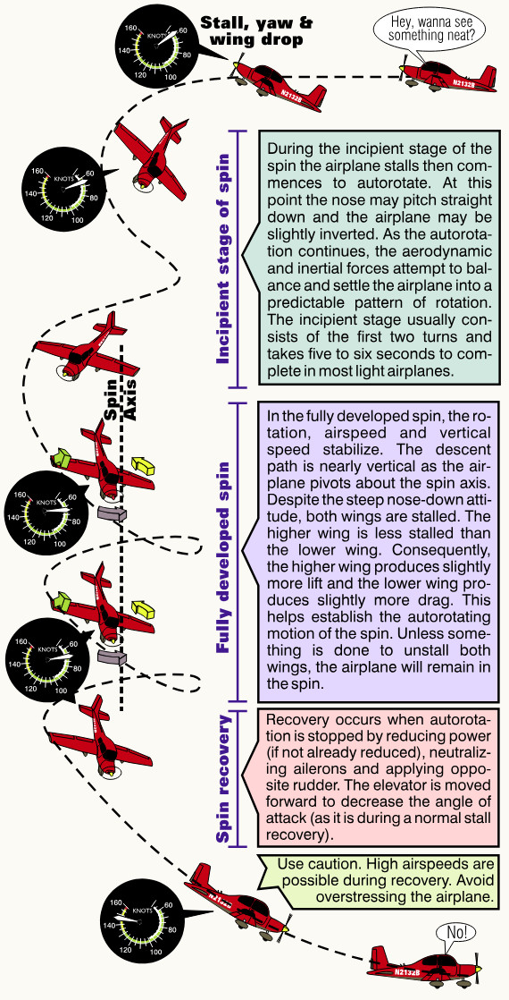

## How A Spin Occurs

To enter a spin the airplane must first be stalled. As the stall occurs, rudder is applied and the elevator is pulled back to further increase the angle of attack. Applying rudder (In the example here.) causes the left wing to simultaneously move downward and rearward. This causes a left roll that increases the left wing's angle of attack and slows its speed relative to the right wing. The right wing, on the other hand, moves upward and forward. This decreases its angle of attack and increases its speed. Despite the fact that both wings are stalled in the fully developed spin, the outside (higher) wing is less stalled than the inside (lower) wing.

Pilots making skidding turns to final put themselves in a critical position that's conducive to spin entry. If the pilot sees he will overshoot the turn to final, he might apply rudder to align the nose with the runway while holding the bank constant with aileron. All the while, he's pulling back on the elevator control in an attempt to keep the nose up. This is the precise condition described above for entering a spin. Unfortunately, when a spin occurs in the traffic pattern, there is often insufficient altitude available for recovery. In a fully developed spin, the airspeed remains constant (for smaller airplanes it's about 65 to 75 knots indicated.). The descent rate can exceed 7,000 feet per minute.

Now we'll discuss about how a spin is entered. There are three additional stages that follow, they are:

1. The incipient stage,
2. The fully developed stage, and
3. The spin recovery

{ .img-medium-large .img-center}