## Critical Angle of Attack

A pilot’s job is to work The Four Forces, maintain lift, and avoid the burbling air condition that results in a stall.
Think of air molecules as little race cars moving over the wing. Each car and air molecule has one objective: follow the curve over the wing’s upper cambered surface. Of course, if the wing is at a low angle of attack, the curve is not very sharp and it’s a pretty easy trip. 

But consider the curve made by these cars and air molecules when the wing is attacking the wind at a very large angle. As the angle of attack exceeds approximately 18 degrees (known as the critical angle of attack for reasons you will soon see), these speed-racer air molecules don’t negotiate the turn. When this happens, they spin off or burble into the free air, no longer providing a uniform, high velocity, laminar airflow over the wing. The wing stalls.

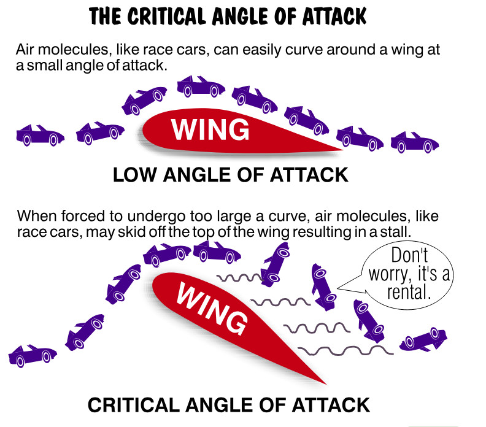{ .img-medium-large .img-center}

## Stalled wings

Remember, according to Bernoulli, lower velocity airflow over the wing produces less lift. There is still impact lift provided by air molecules striking the underside of the wing, but we’ve already learned that this doesn’t provide nearly enough lift to sustain the airplane. When there’s less lift than weight, bad things happen to good airplanes. The wing goes on strike and stalls. Abandoned by Bernoulli, gravity summons the airplane to earth on its own terms.

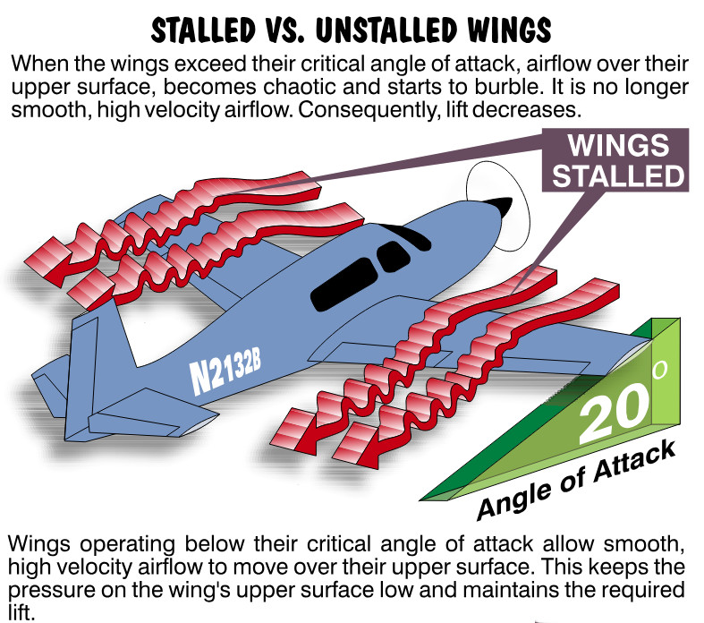{ .img-medium-large .img-center}

All wings have a ***critical angle of attack*** (the angle varies slightly among airplanes). Beyond this angle the wing and the wind don’t work and play well together. All the whispered theory in your heart won’t overcome the laws of physics and aerodynamics. The wing police are always watching. Exceed the critical angle of attack and the air molecules won’t give you a lift. Sounds serious, and it can be. Fortunately, there’s a readily available solution, and it is not screaming, “Here, you take it” to the instructor.

## Exceed the Critical Angle of Attack

You can unstall a wing by reducing the angle of attack. You do this by *gently* lowering the nose of the airplane with the elevator control. Easy does it here, Power Ranger. Once the angle of attack is less than its critical angle, the air molecules flow smoothly over the top of the wing and production of lift resumes. It’s as simple as that. Please don’t ever forget this.

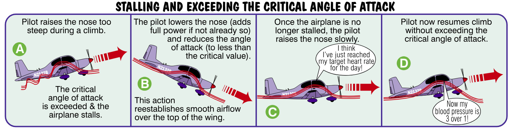{ .img-large .img-center}

Why am I making such a big deal out of this? Why did I make you put your finger back in your ear? Because in a moment of stress (having the wing stop flying creates stress for many pilots) you will be inclined to do exactly the opposite of what will help. Pilot's have a natural response to pull or push on the elevator control to change the airplane’s pitch attitude. During a stall, as the airplane pitches downward, your untrained instinct is to pull back on the elevator control. You may yank that critter back into your lap, and the result will not be good. The wing will remain stalled and you, my friend, will have the look of a just gelded bull. If the wing stalls, you need to do one very important thing: reduce the angle of attack to less than its critical value. Only then does the wing begin flying again. Adding full power also helps in the recovery process by accelerating the airplane. The increase in forward speed provided by power also helps reduce the angle of attack. Don’t just sit there with stalled wings. There’s a reason why you are called the pilot-in-command. Do something! But do the right thing!

## Stall at Any Attitude or Airspeed

You should realize that airplanes can be stalled at any attitude or at any airspeed. *It makes no difference whether the nose is pointed up or down or whether you are traveling at 60 or 160 knots. Whether an airplane exceeds its critical angle of attack is independent of attitude or airspeed*.

## Stall Recovery - Nose Down

 Airplanes have inertia, meaning they want to keep on moving in the direction they are traveling. Imagine an aircraft pointed nose down, diving at 150 knots (don’t try this at home!). The pilot pulled back too aggressively, forcing the wings to exceed their critical angle of attack. The airplane stalls. Wow! Imagine that. It stalls nose down at 150 knots!

 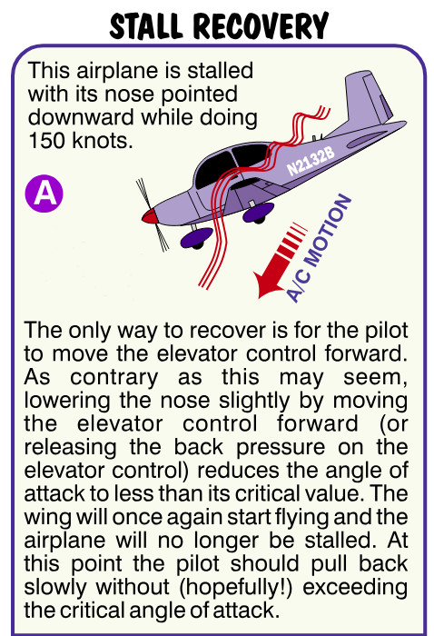{ .img-large .img-center}
 
 What must the pilot do to recover? The first step is to decrease the angle of attack by moving the elevator control forward or releasing back pressure on the control wheel/stick (remember, pulling back on the elevator control was probably responsible for the large angle of attack inducing the stall in the first place.) This re-establishes the smooth, high velocity flow or air over the wings. The airplane is once again flying. 
 
 The second step requires applying all available power (if necessary) to accelerate the airplane and help reduce the angle of attack. Once the airplane is no longer stalled, it should be put back in the desired attitude while making sure you don’t stall again. Stalling after you’ve just recovered from a previous stall is known as a secondary stall. Unlike secondary school, it is not considered a step up, especially by the participating flight instructor.

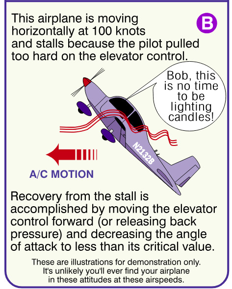{ .img-large .img-center}

## Stall Recovery - Level Flight

Stalling an airplane intentionally, at a safe altitude, is actually fun, or at least educational. Stalls are relatively gentle maneuvers in most airplanes. Stalling an airplane close to the ground, however, is serious business because it is usually not an intentional act. During flight training you’ll have ample practice in stall recovery. Managing a stalled airplane is one thing; managing your natural instincts, another. For example, a typical stall trap you could (literally) fall into involves a high sink rate during landing. While on approach, you might apply back pressure on the elevator, attempting to shallow the descent. If you exceed the critical angle of attack the airplane will stall. The runway now expands in your windshield like a low orbit view of a supernova. If you follow your untrained instincts and continue to pull backward on the elevator, the stall deepens. Trained pilots know better. They are aware of the possibility of stalling and apply the appropriate combination of elevator back pressure and power during landing to change the airplane’s glide path without exceeding the critical angle of attack (your instructor will show you the appropriate use of elevator and power during landing). How do pilots know the proper amount of rearward movement to apply to the elevator? How do they know they won’t stall the airplane? If there was an angle of attack indicator in your airplane, stall recognition would be easy. You’d simply keep the angle of attack less than what’s critical for that wing. Angle of attack indicators, although valuable, are very rare in small airplanes. Fortunately, there are several ways to recognize a stall’s warning signs.

## Five Stall Warning Signs

There are five good early warning clues to indicate the onset of a stall. Good pilots know and watch for all of them. 

First, an unmistakable buffet or shaking is usually felt in the airplane and on the flight controls. You might think your instructor is shaking the other set of controls trying to get you to let go of them. Not true. As airflow begins to separate from the top of the wing, it buffets (burbles). For those with only food on their mind, this is BUFF-ETTES, not BOO-FAYS. One means getting lunch, the other can mean losing it. Inside the cockpit, this buffet is felt as vibration and is one of the best early warning clues to an impending stall. If you feel this buffet, simply release some of the backward pressure on the elevator until the buffeting stops.

Second, flight control response usually diminishes when the airplane approaches a stall. If you feel the controls becoming mushy or less effective, this is your cue that things aren’t going well. Think stall. Think lower angle of attack. Think quickly.

Third, when the airspeed indicator is nearing the beginning of the white or green arc, you’re approaching stall territory. Airplanes must have airspeed to fly. Slow the airplane down too much and it will eventually stall. Keep an eye on the airspeed indicator and make sure it’s a healthy distance above the beginning of the green arc. This is the power-off stalling speed without flaps and gear extended (called the *clean configuration*). When approaching to land, the usual recommendation is to keep the airspeed at least 30% above stall speed. This gives you room to accommodate slight, unexpected variations in airspeed caused by poor technique or wind shear. A good visual clue indicating slow speed is when cars on the road below are moving faster than you are at rush hour.

Fourth, a distinct difference in sound occurs when approaching a stall. When I was taking lessons this sound usually came from my instructor yelling, “Lower the nose, goofball, lower the nose!” When airflow strikes the airplane at higher angles of attack, it often makes a different, but recognizable sound.

Fifth, all modern airplanes have stall warning horns or lights. These tattletale devices activate a few knots above stall speed and provide an excellent pre-stall warning when they’re working and when the pilot’s listening. On some airplanes it’s difficult to test the stall warning horn during the preflight walkaround. That means you won’t know it’s not working until you need it. You will also be surprised what you can ignore while concentrating on the radio, your instructor, or the pretty colors on all the gauges. That’s why you must use all the clues, not just one or two. Aside from these five basic stall warning signs, the seat of your pants provides an additional clue. Let me explain.

## Stalling Speed, Gee Whiz And G-Force

Ever watched somebody use a personal computer when something goes wrong? What’s      the first thing they do? They repeat what they just did, as if the electrons might go with a different flow the second or third time around. Computers are highly predictable, and so are airplanes. ***For instance, when the weight of an airplane increases, the aircraft will stall at higher speeds***. That’s right, every time. Son of a gun.

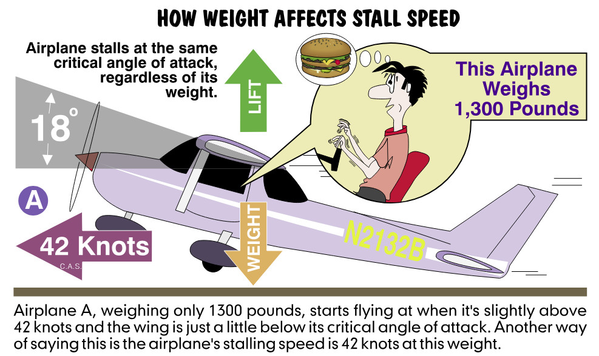{ .img-large .img-center}

Let’s assume that a lightly loaded airplane begins flying at 42 knots when the angle of attack is slightly less than its critical value. At 42 knots, just enough lift is developed to equal the air-
plane’s weight (although the airplane is on the verge of a stall). An increase in weight means the wings must develop more lift to remain airborne. Certainly the airplane won’t fly at or beyond its critical angle of attack (18 degrees for this airplane) since this is the built-in design limit of the wing. Under these conditions, the only way a heavier airplane can develop more lift is to move forward at a slightly faster speed. 

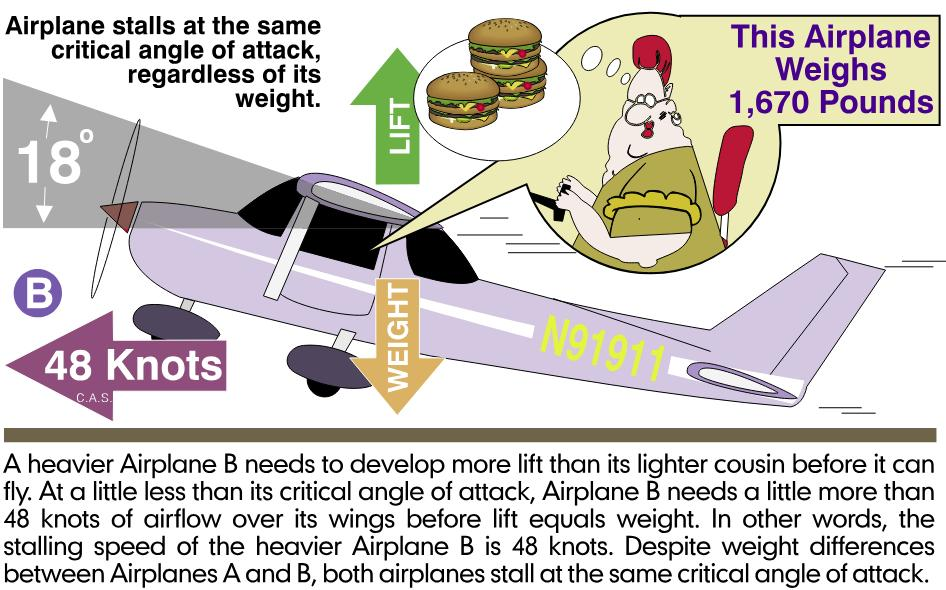{ .img-large .img-center}

A heavier airplane in our example might need a minimum forward speed of 48 knots before the wings develop enough lift to equal the increase in weight.  The critical angle of attack at which the wing stalls never changes, but the minimum speed at which the airplane begins flying does change. If the airplane is heavier, it stalls at a higher speed. The converse is also true; lighter weights mean slower stall speeds. (I don’t want to give you the impression that we start climbing during the takeoff once we’re at or slightly above the airplane stall speed. That’s not true! We normally accelerate to a safe margin above stall speed, 30 percent or more depending on what your flight instructor recommends, then climb.)

## Centrifugal Force

Think back to the last time you were on a rollercoaster. On the straightaway all you felt was speed. Turns, however, forced you down in the seat. You experienced an increase in your apparent weight when turning because of something known as centrifugal force. This is the same force that makes you feel you might fall out of the car while turning if your seat belt isn’t fastened. 

Because airplanes bank (like cars on a banked road), centrifugal force and gravity pull you down in your seat. You and the airplane can expect to feel this apparent increase in weight during a turn. The wings don’t know what’s causing the airplane to feel heavier, and frankly, my dear, they don’t give a darn. They only know that it’s getting heavier. The steeper the turn, the greater the centrifugal force and the more you and the airplane appear to become heavier. This force is often called ***G-force.***  Perhaps it was so named because students often say, “Geeeeeeeeeeee” whenever they feel their apparent weight increase. The term the pocket protector set (or engineers) use for G-force is ***load factor***  (we’ll use both terms synonymously).

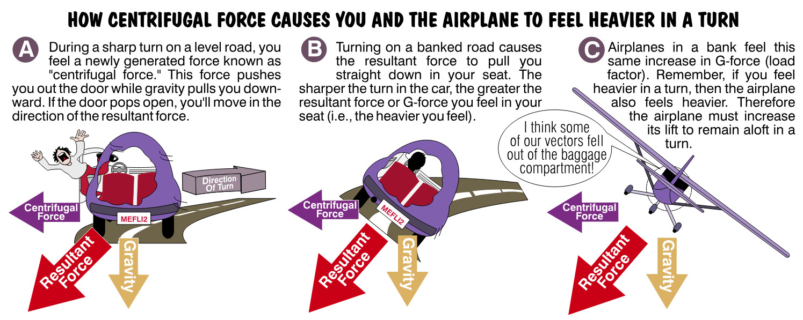{ .img-large .img-center}

## Load Factor Chart

Load factor increases as a function of bank. A 60 degree bank produces 2Gs. This means you and the airplane feel twice as heavy as you actually are. If the airplane weighed 2,300 pounds, its structure is required to support 4,600 pounds in a 60 degree bank at a constant altitude. 

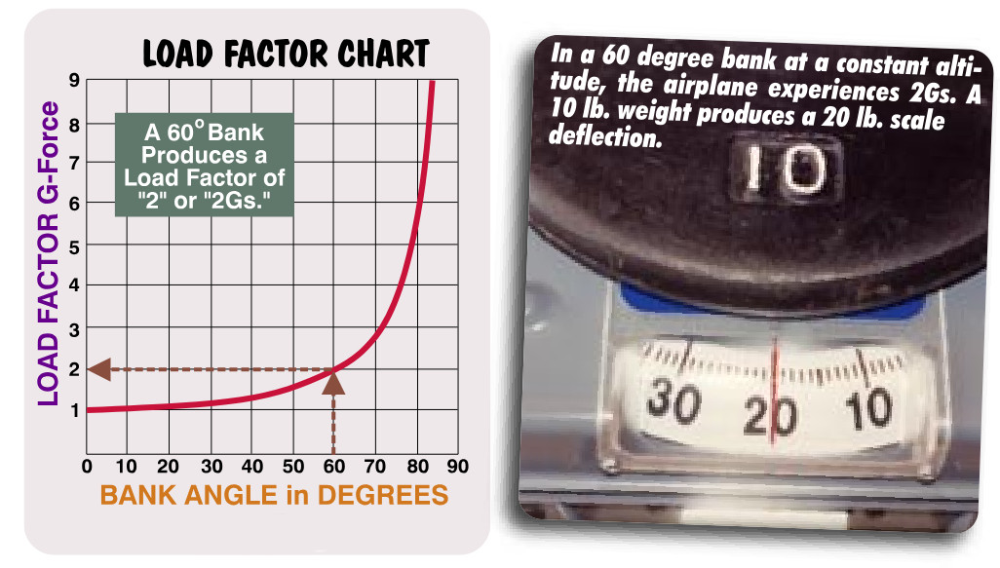{ .img-large .img-center}

Here is the most important point about increasing the G-force. *If the airplane feels twice as heavy as it actually is, then the lift must double if the airplane is to maintain altitude.*  How can you increase lift? ***Creating a larger angle of attack by applying elevator back pressure, going faster by increasing the power, or a combination of both will increase the airplane’s lift production.*** 

## Angle of Bank and Angle of Attack

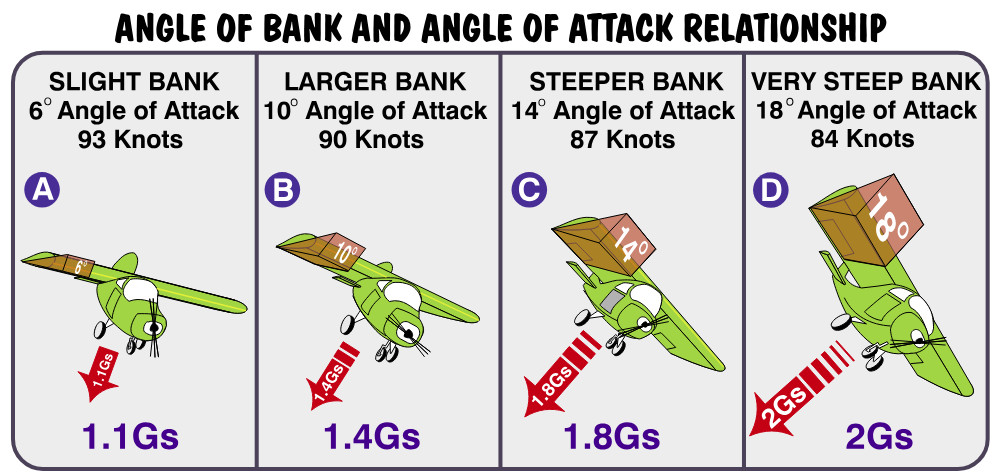{ .img-large .img-center}

During *steep turns* you typically apply back pressure on the elevator control while attempting to maintain your altitude. This increases your angle of attack and increases lift to compensate for the increasing G force. Prior to entering a slight bank at an airspeed of 100 knots, this airplane’s angle of attack was 4 degrees. With a slight bank, back pressure is required and the angle of attack increases to 6 degrees. The increased angle of attack provides an increase in lift but it also exposes more of the wing’s underside to the airflow and increases drag. Now the airspeed drops to 93 knots. 

As the angle of bank steepens the angle of attack must be increased to maintain altitude. The airspeed continues to decrease because of the increased drag. If you were paying attention back in the stall department, you can see where this flight is going. When the bank is very steep, the airplane reaches its critical angle of attack and slows to 84 knots, Airplane D is now at its critical angle of attack. Any further attempt to increase the bank while holding altitude stalls the airplane. While this particular airplane stalled at 60 knots in level flight, it now stalls at 84 knots in a very steep bank. The moral of this story is that an increase in weight (apparent or real) causes the speed at which the airplane stalls to increase. 

In other words, ***when you feel an increase in G-force (load factor), the airplane’s stalling speed is also increasing***. Normally you would increase your power in a steep turn to prevent the airspeed from getting too slow. Giving this particular airplane full throttle in a very steep turn might keep the airspeed at 90 knots. This gives you a 6 knot buffer above the steep turn stalling speed in this example. Of course, this assumes that your engine is capable of producing this extra power in the first place. This simply isn’t an option in our smaller, horsepower anemic airplanes, is it?

## Stall Speed And Bank Angle

The increase in stall speed with bank angle is as predictable as a politician’s addiction to podiums. A 60 degree bank increases stall speed by 40 percent. This is certainly nice information to know, but are you expected to carry a Cray supercomputer and punch in percentages prior to any turn? Of course not. What you need to have is a high index of suspicion. If the seat of your pants says you’re weighing in at a level that qualifies you for the main event on a heavyweight boxing card, you should think (quickly), about how the stall speed increases in a turn. For those of you frightened by higher math (adds, takeaways, times and goes-intos) there is an easier way to calculate this.

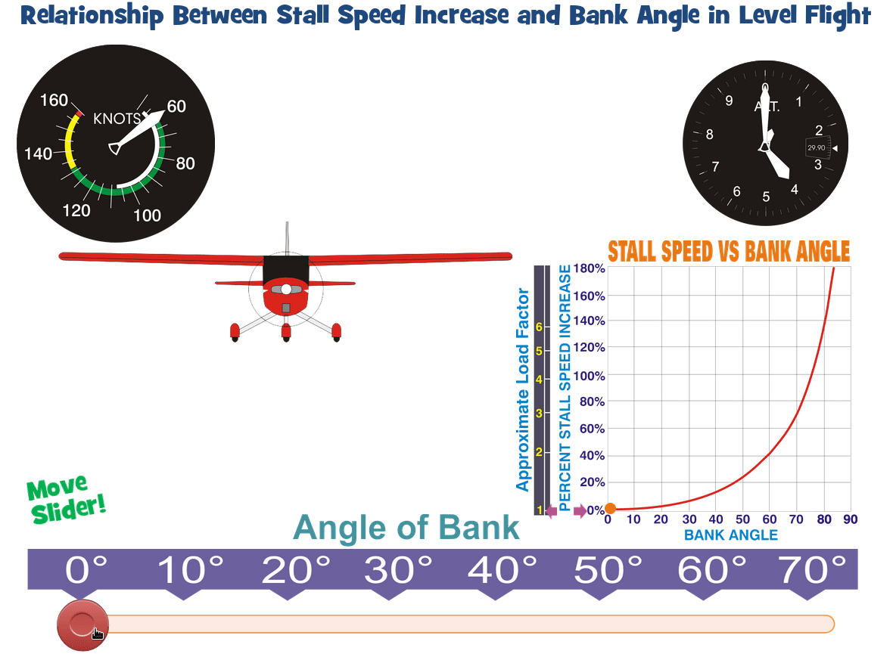{ .img-medium-large .img-center}

Figure 33 is typical of the stall charts found in most owners’ manuals. It provides you with the stall speeds for specific angles-of-bank under variable flap conditions (we’ll discuss flaps in a bit). 

## POH Stall Speed Chart

Most owners manuals contain Stall charts. They provide you with a stall speed with specific Angles of bank under variable flap conditions (We'll discuss flaps in a bit.) Avoiding stalls while in a steep bank with smaller, power-limited airplanes means you must be prepared to do two things. At the first sign of a stall, you must unload the wings by releasing back pressure on the elevator and simultaneously reducing the angle of bank. This decreases the load factor and reduces the stall speed. For example, assume that you’re in the traffic pattern and are making a turn onto final approach. Because of poor planning (it happens to everyone once in a while), you find yourself overshooting the runway centerline. Increasing the bank is a natural response to prevent overshooting, but it’s also a risky one. When the bank increases, the nose wants to lower or pitch down (I’ll talk about why this happens later). Pilots typically pull back on the elevator control to maintain altitude in response to a dropping nose. Pulling back on the elevator increases the angle of attack and slows the airspeed. Now the airplane is closer to its critical angle of attack at a lower airspeed. If the airplane was flying slow to begin with, the airplane may stall. What’s the solution? 

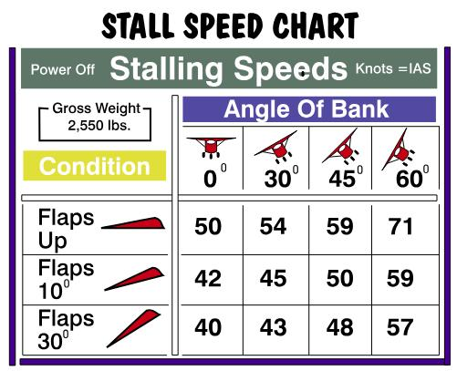{ .img-medium-large .img-center}

Whenever you are making a turn, especially when close to the ground, be especially sensitive to the amount of bank you use. *Be sensitive to the G-force you experience.* If you feel your apparent weight increasing, you now know your stall speed is also increasing. Your derriere becomes the ultimate stall sensing device (and to think you’ve been packing that thing around all these years and didn’t realize its usefulness). This is what is called, “flying by the seat of your pants.” If anyone accuses you of sitting down on the job, you just tell them you’re testing your stall detector.
By the way, there is a time when we want our wings to stall before they experience too many Gs. The speed at which this occurs is called the ***design maneuvering speed.*** 

## T-Tail Airplanes

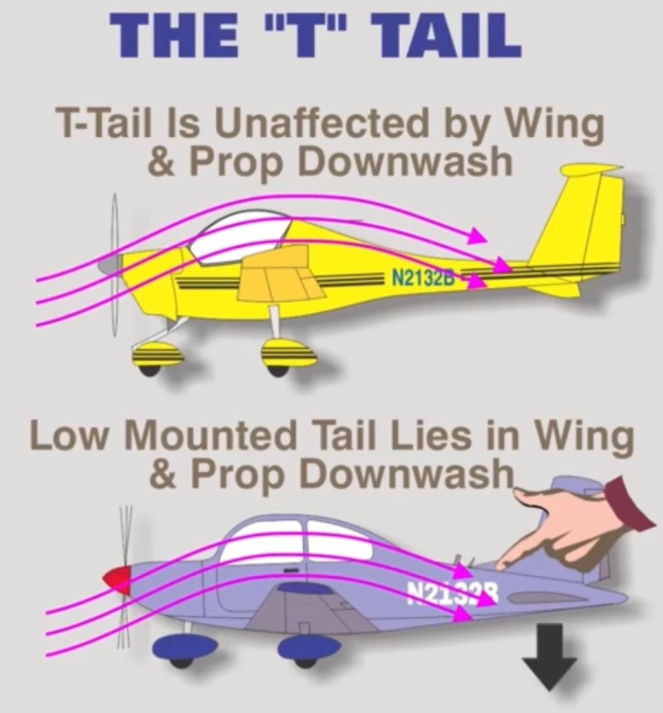{ .img-medium .img-center}

On airplanes having low mounted tails, downwash from the propeller and the wings provides a downward acting force on the tail. Power reduction reduces this downwash and is followed by a nose-down pitch. In this respect, the airplane has less longitudinal stability since its pitch is affected by power changes. T-tail air-planes are less affected by this, since the tail is above this downwash. Additionally, the T-tail provides one of the best configurations for spin recovery. Disadvantages are usually heavier weight for T-tail construction as well as complicated elevator control and trim linkages. *The forces required to raise the nose of a T-tail aircraft are greater than the forces required to raise the nose of a conventional-tail aircraft due to the tail surface being above the propeller's downwash*. When flying at a very high angle of attack with a low airspeed and an aft center of gravity, the T-tail aircraft may be more susceptible to a ***deep stall***.

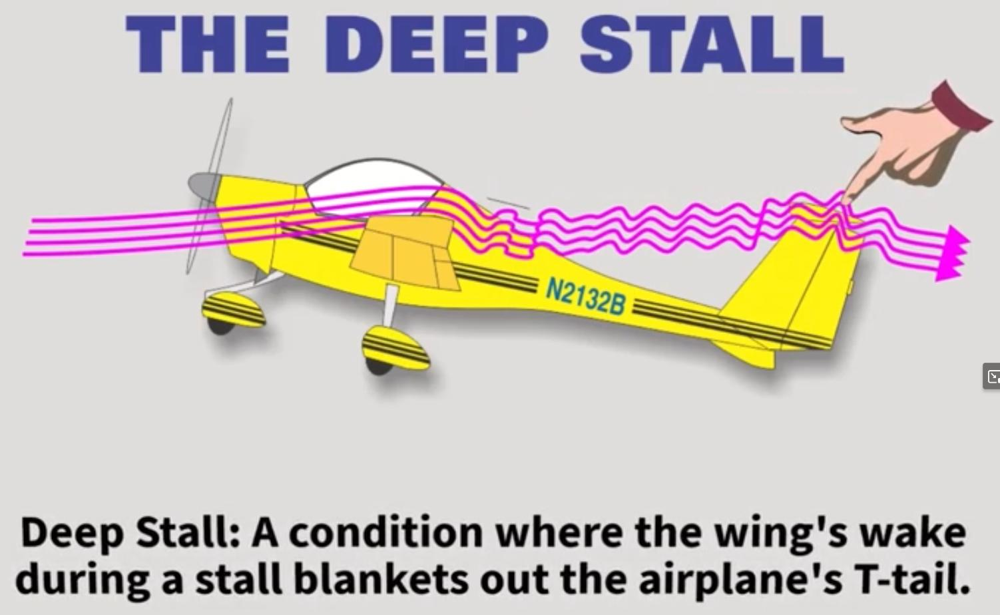{ .img-medium-large .img-center}

Deep stall? What is this thing called a deep stall? Well, when flying at a very high angle of attack with a low airspeed and an aft center of gravity, the T-tail aircraft may be more susceptible to a deep stall. In this condition, the wake of the wing impinges on the tail surface and renders it almost ineffective. ***The wing, if fully stalled, allows its airflow to separate right after the leading edge. The wide wake of decelerated, turbulent air blankets the horizontal tail and hence its effectiveness diminished significantly. In these circumstances, elevator or stabilator control is reduced (or perhaps eliminated) making it difficult to recover from the stall***.

{ .img-medium-large .img-center}

It should be noted that an aft center of gravity is often a contributing factor in these incidents, since similar recovery problems are also found with conventional tail aircraft with an aft center of gravity. ***Deep stalls can occur on any aircraft but are more likely to occur on aircraft with “T” tails as a high angle of attack may be more likely to place the wing-separated airflow into the path of the horizontal surface of the tail***. Additionally, the distance between the wings and the tail, the position of the engines (such as being mounted at the rear of the airplane) may increase the susceptibility of deep stall events.

{ .img-medium-large .img-center}