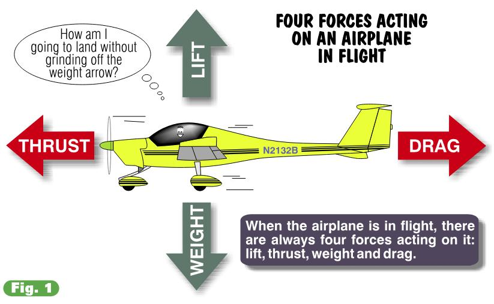
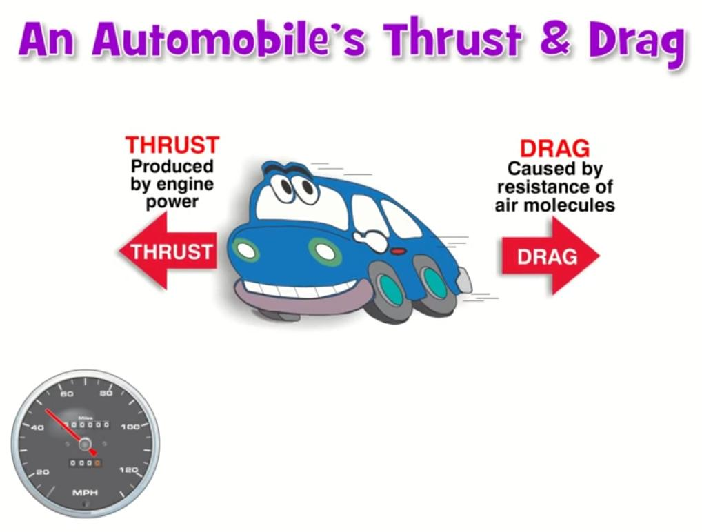

# The Four Forces

## The Wing is The Thing 

You don’t need a Ph.D. in aerodynamics to be a pilot, but moderate-to-decent understanding of why an airplane stays airborne will prove very helpful and life sustaining.  As one aviator elegantly put it, “The wing is the thing.” It’s the thing that performs the magic; the pilot simply manages the show.

## May the Four Force be With You

Yoda, the transcendental handheld philosopher from the Star Wars movie trilogy, frequently dispatched Luke Skywalker with the benediction, “May The Force be with you.” In aviation, there are Four Forces and they are always with us, whether Yoda or your flight instructor intervenes or not. Under Yoda’s tutelage, Luke extracted from Mother Nature the mightiest of her secret powers. Aeronautical engineers-taller, without green complexions, blanketed with pocket protectors-do the same, designing airplanes to create a compromise among The Four Forces. This results in the ability of your trusty airplane to fly. Compared to crafting this compromise, settling the Middle East conflict is novice-level work.

## The Four Forces Named

The Four Forces: ***lift, weight, thrust and drag***. Are present any and every time a plane is airborne. Your job, as pilot, is to manage the resources available in order to balance The Four Forces. Learning to fly is really learning to manage The Four Forces. Almost everything you do in the cockpit will result in making a change to one or more of these forces. Let’s see what they’re all about. 

{ .img-medium-large .img-center }

## Lift

***Lift*** is the upward-acting force created when an airplane’s wings move through the air. Forward movement produces a slight difference in pressure between the wings’ upper and lower surfaces. This difference becomes lift. It’s lift that keeps an airplane airborne. I discovered how lift works at four years of age, during my very first visit to church. The collection plate passed in front of me and I picked out a few shiny items. My grandfather chased me around the pew and I thought, “Wow, church is fun!” Picking me up by my sweater, grandpa held me suspended four feet off the ground and toted me outside. It was the lift from grandpa’s arm, precisely equaling my weight, which kept me airborne. Wings do for the airplane what grandpa’s arm did for me-provide the lift to remain aloft.

## Thrust 

***Thrust*** is a forward acting force produced by an engine-spun propeller. For the most part, the bigger the engine (meaning more horsepower) the greater the thrust produced and the faster the airplane can fly-up to a point. 

## Weight

***Weight*** is the downward-acting force. It’s the one force pilots control to some extent by choosing how they load the airplane. With the exception of fuel burn, the airplane’s actual weight is difficult to change in flight. Once airborne, you should not be burning cargo or acquiring extra passengers. In unaccelerated flight (when the airplane’s speed and direction are constant), the opposing forces of lift and weight are in balance.

## Drag

Forward movement always generates an aerodynamic penalty, called ***drag***. Drag pulls rearward on the airplane and is simply the atmosphere’s molecular resistance to motion through it. In plain English (which pilots and engineers rarely use), it’s wind resistance. Kaiosan, always remember few things are free with Mother Nature. As Confucius might say, “Man who get something for nothing not using his own credit card.” Thrust causes the airplane to accelerate, but drag determines its final speed. As the airplane’s velocity increases, its drag also increases. Due to the perversity of nature, doubling the airplane’s speed actually quadruples the drag. Eventually, the rearward pull of drag equals the engine’s thrust, and a constant speed is attained.

## Thrust And Your Car

My high school VW Bug knew these limits well (it’s called a Bug because that’s the largest thing you can hit without totaling the car). The Bug’s forward speed is limited by its engine size. With four little cylinders (three of which worked at any one time), this VW simply wouldn’t go faster than 65 mph. Maintaining a slower speed requires less power, since less drag exists. At any speed less than the maximum forward speed of the car, excess thrust (horsepower) is available for other uses, such as accelerating around other cars or perhaps powering a portable calliope if you are so inclined. 

{ .img-medium-large .img-center }

The same is true of airplanes. At less than maximum speed in level flight, there’s power (thrust) to spare. Excess thrust can be applied to perform one of aviation’s most important maneuvers-the climb.