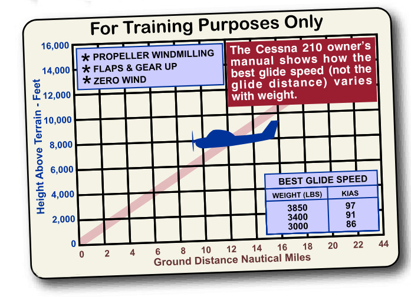
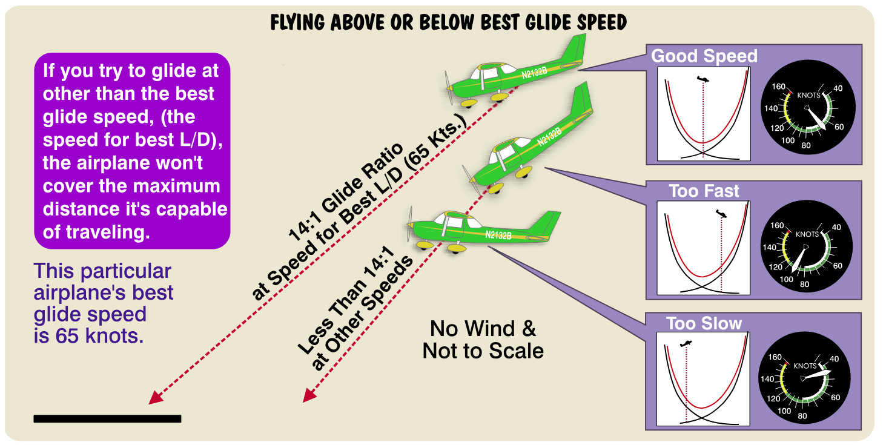
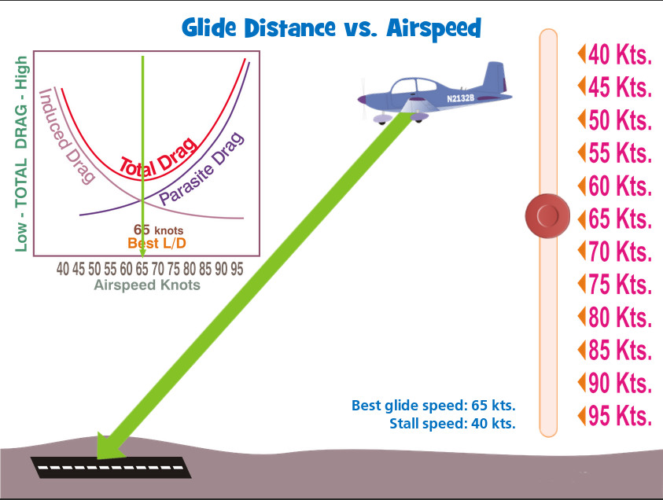

## Total Drag And Your Go Far Speed

What does all this talk about parasite and induced drag mean to you as a pilot? It could mean as little as knowing how to save a few bucks on fuel, or it could mean as much as knowing how to protect your remarkably fragile hide in the event of an emergency. As the airplane speeds up, induced drag decreases while parasite drag increases. Is there a specific speed, a number better than all other numbers, where the total drag on the airplane is at a minimum? Yea verily, there is.

### Total Drag Curve

 Unlike Bigfoot, the Loch Ness Squid and Elvis. A minimum drag speed actually exists. When the induced and parasite drag curves are added together to produce a total drag curve, there is always a point where the sum of both curves is at a minimum. The lowest spot in the total drag curve is your magic number, a specific airspeed known as the ***best L/D speed.*** (pronounced “best L over D speed,” which stands for “lift over drag”). ***Since minimum drag occurs at this speed, minimum thrust for forward flight must also occur at this speed.***

 *Minimum thrust* means we obtain maximum forward distance for a given amount of fuel consumption. The best L/D speed yields the maximum range for a tank (or a gallon or a thimbleful) of fuel in a no-wind condition. If L’s and D’s and minimum thrust don’t stick well, try thinking of this magic number as your “maximum range” or “go far” speed. This speed also yields the airplane’s maximum power-off glide range, which is where the saving your hide part comes in. “Power-off glide” is a nice way of saying the engine isn’t working at the moment, and you are now the pilot of a glider, looking for a landing spot. So immediately establish the proper gliding attitude and airspeed. This is a time when you will want the ability to go as far as is necessary to find that spot.

### Best Glide Profile in POH

{ .img-medium-large .img-center}

### Stretching the Glide, Saving the Hide

As a precaution, I have avoided, to the extent possible, using mathematics in this book. However, I  want you to think of L/D as a ratio of lift to drag. Don’t think about a ratio as a “goes-into” or division problem. Think of it as comparing one value (lift) placed on top of another (drag), separated by a line. A “power-off glide” happens under one of two conditions. 

One is instructor-induced. It comes accompanied by some ominous-sounding incantation such as “You’ve just had an engine failure,” and the instructor pulling the throttle back to idle. This is a not-really-power-off glide. You may, at this awkward time, be asked what the plane’s best L/D speed is, or what the glide ratio is.

The other occasion is a real power-off glide, caused by a real engine failure. This is the time when you wish you were wearing your Kevlar power suit and accompanying roll bar. At moments like that, you really do want to know the best L/D speed and have some idea of what the plane’s glide ratio is.

### Best Glide Speed

In a power-off glide, the best L/D speed allows the airplane to glide a maximum forward distance with a minimum amount of altitude loss. For example, the DA20 Katana has a lift-over-drag ratio of approximately 14 to 1 (also written as 14:1) at its best L/D speed (65 kts.). At this speed the airplane experiences minimum drag (at the bottom of the total drag curve) and moves 14 feet forward for every foot it descends. No matter what you do to the airplane, this is the best glide ratio it’s capable of attaining. You can rock back-and-forth in your seat and yell, “Come on big fellow, come on, yee-hawww!” and the airplane still isn’t going to glide better than 14 feet forward for every foot it drops. If you attempt to glide at some speed other than this one, your airplane simply won’t glide as far.

{ .img-large .img-center}
{ .img-medium-large .img-center}