## Defining the Wing

The wing has several distinct parts. These are the *upper cambered surface, lowered cambered surface, leading edge, trailing edge and chord line.* Notice that the upper cambered (meaning *curved*) surface seems to have a greater curve to it than the lower cambered surface. This isn’t accidental. In fact, this is so important that we’ll talk about it in detail shortly.

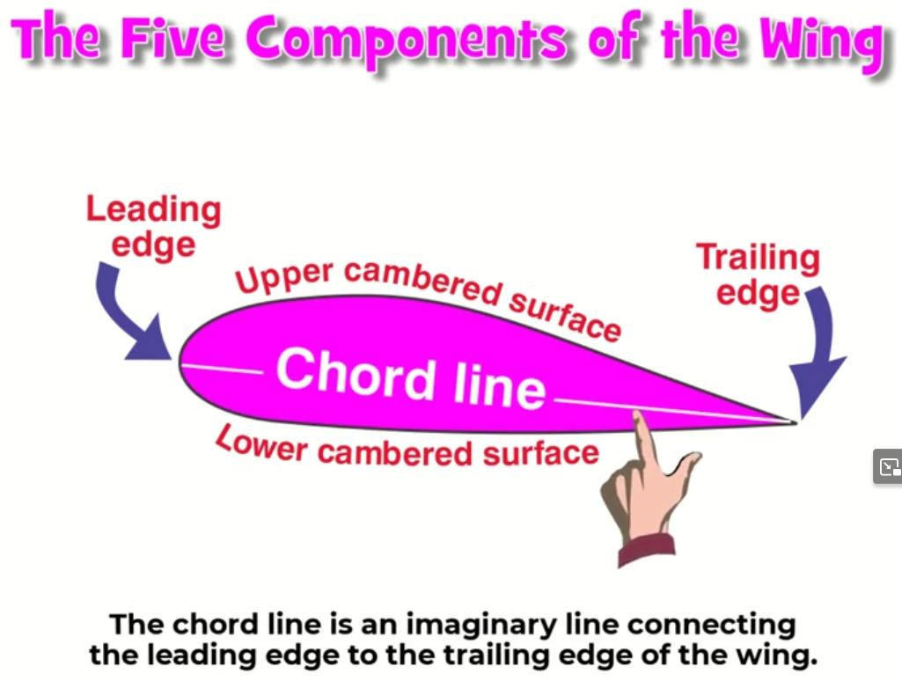{ .img-medium .img-center }

Perhaps the only term whose definition isn’t intuitively obvious is the *chord line.* The chord line is an imaginary line connecting the leading edge with the trailing edge. Believe me, there is no line inside the wing that looks like this, it’s only imaginary. When the shoe salesman points to your foot and says, “Your toe is here,” you want to respond by saying, “Thanks, I’ve been looking for that.” In reality he or she is pointing out the position of something not visually obvious. The chord line does something similar. Given the wing’s curved surfaces, it’s difficult to tell which way the wing points. Since engineers don’t like uncertainty, they agreed that the chord line will represent the general shape of a wing. 

## How the Wing Works

To understand ***lift***, you must visualize how the wing attacks the air. Aeronautical engineers talk about the wing *contacting* or *attacking* the air at a specific angle. This occurs in much the same way a pitbull attacks a mailman-mouth first. What part of the wing does the attacking? Is it the leading edge? Is it the trailing edge? Or, is it the bottom of the wing? This is where the definition of ***chord line*** becomes useful.

## Angle of Attack

Because wings come in variable sizes and shapes (just like airline pilots), it is sometimes difficult to determine exactly how and where the wind strikes the wing. Fortunately, the chord line substitutes as a general reference for the shape of the wing. If I can say that the wind blows onto the wing at an 18 degree angle, I’m saying that the angle between the wind and the chord line is 18 degrees. This distinction, although seemingly trite, is as important to an engineer as tightly-stitched pant seams are to a matador. Only one more definition need be absorbed before the secrets of lift are revealed. That term is called the ***relative wind***. 

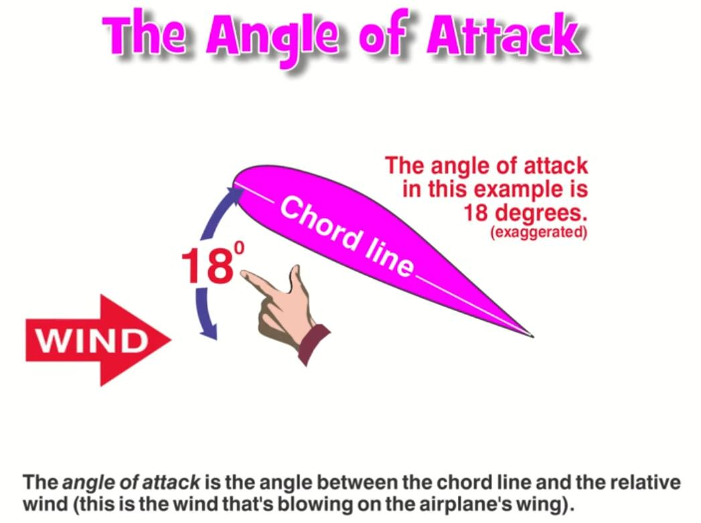{ .img-medium .img-center }

## Relative Wind

Movement of an airplane generates wind over the wing. This wind is called the ***relative wind*** because it is relative to (or results from) motion. To illustrate this point, stick your hand out the window of a moving automobile (keep all other body parts inside, please). You’ll feel wind blowing opposite the motion of the car. Drive a car backwards on the freeway and you will feel wind, and hear a lot of horns, blowing from directly behind you (you’ll also attract the police, so have those doughnuts ready). Relative wind is movement-generated wind that’s equal and opposite to the motion of the airplane.

### Relative Wind and Motion

 Move the airplane forward and wind blows on its nose. Move the airplane up or down a hill and wind still blows on its nose. Drop an airplane and the wind blows on its belly, despite its level attitude. In such a condition your passengers, are probably underneath the front seat in the fetal position, making spiritual transmissions that don’t require a radio. Do not scare your passengers. It isn’t nice, and they don’t like it. Relative wind blows from a direction that’s opposite the direction of airplane motion, irrespective of what direction the airplane’s pointed. 

 **The important principle to remember is that relative wind is independent of which way the airplane’s nose is pointed.  Relative wind is opposite in direction and equal to the airplane’s velocity**. Let’s see how the wing actually attacks the wind to develop lift.

 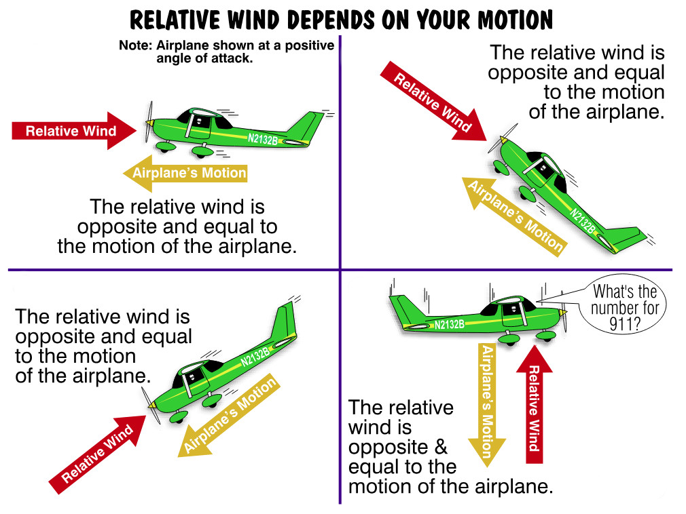{ .img-medium-large .img-center }

## Atacking the air

Hunting is a sport to some people. It’s also a sport where your opponent doesn’t know it’s a participant. Attacking a mammal means that the hunter must point his weapon precisely at the prey. The hunter looks though the gunsight and sees the path of the bullet. An airplane is unlike a gun (and a car) in that its vertical climb path is different from its incline (the direction it points upward). Remember that 750 foot tower off the end of the runway? On takeoff, if you point your airplane slightly above the top of that obstacle (like a rifle sight), it’s unlikely that you’re going to clear it. In fact, the only thing being cleared is the area, as the firemen try to talk you down from the side of that tower. **Remember, airplanes with limited thrust have shallower climb paths unlike some fighter jets**.

 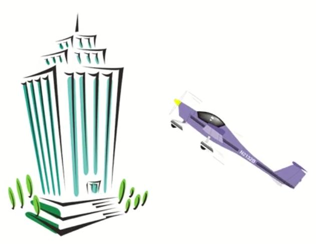{ .img-medium .img-center }

The most important principle to understand here, is that the nose (therefore the wing) can be pointed on an incline that’s different from the actual climb path. An angle exists between the amount the wing is inclined and its climb path (you’ll soon see why). **Remembering that the relative wind is always equal and opposite to the flight path**, it’s more precise to say that an angle exists between the chord line and the relative wind. This angle is known as ***the angle of attack***.

 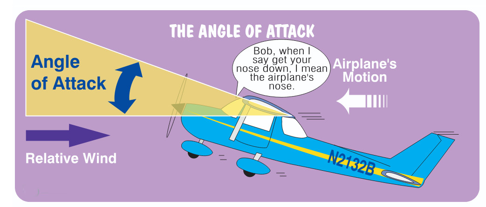{ .img-medium-large .img-center }

### Different Angles of Attack

If the chord line of Airplane's wing is making a 5 degree angle to the relative wind. The wing’s angle of attack is 5 de-grees. The greater the difference between the wing and the relative wind, the greater the angle of attack. And, as you’re about to see, the wing’s lift is directly associated with its angle of attack.

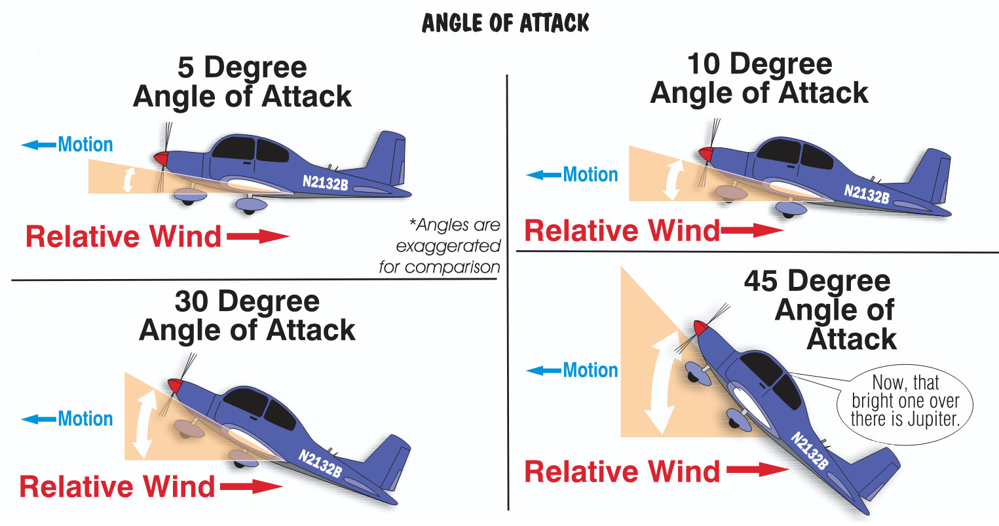{ .img-medium-large .img-center }

## How Lift develops

The wing is the ultimate air slicer. As powerful as any Ginzu knife, Samurai sword or karate chop, it’s a precision device for slicing air in a very specific way. Wings are expressly built to plow through air molecules separating them either above or below while offering little resistance in the horizontal direction. Any horizontal resistance slows the wing down. This horizontal resistance is ***drag***, and it’s definitely a case of less being better.

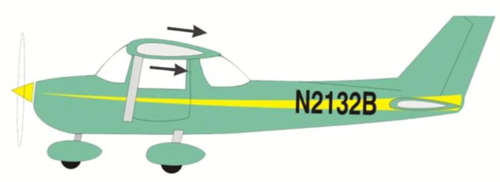{ .img-medium-large .img-center }

## Airflow Around the Airfoil

Airflow strikes the leading edge of the wing forcing some air over and some under the ***airfoil*** (a fancy name for a wing). Both the air flowing over and the air flowing under the wing are responsible for generating lift. Let’s first examine how the airflow striking the bottom of the wing produces some of the total lift that is developed.

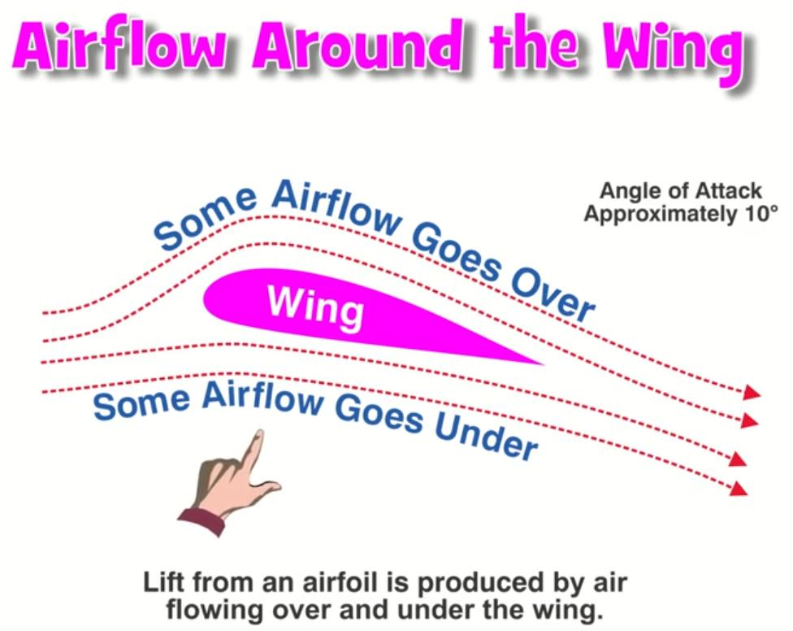{ .img-medium-large .img-center }

### Impact Versus Pressure Lift

Sticking your hand out the window of a moving automobile does two things: it demonstrates how a relatively flat surface develops lift and it signals a left turn. According to Sir Isaac Newton, who knew about such things, for every action there is an equal and opposite reaction. Wind deflected downward by the airfoil creates an upward (opposite) movement of the wing. This upward movement is caused by the impact energy of billions of tiny air molecules striking the underside of the wing. Also, higher pressure on the bottom surface of the wing results from this molecular impact. The wing moves upward as if it were pushed from below. This type of lift is known as ***barn door*** or ***impact*** lift. It generally contributes only a small portion of the total lift produced by the wings, which means that man and woman do not fly by barn door lift alone. If we could, it would mean people in the Midwest would report flying barn doors instead of UFOs. A more subtle and powerful form of lift occurs from curved airflow over the top of the wing.

## Bending The Wing

Airliners (indeed all airplanes) bend something else-they use their wings to bend the wind. ***Wind bending*** did not sound sophisticated enough to explain why airplanes fly, so it was given a fancy Greek title. We call wind bending ***aerodynamics.*** Simply stated, the wing is a precision device for bending or curving the wind downward. But how does bending the wind over the wing create lift? Let’s find out.

*"Greetings. I am professor Burner, Bunsen Burner. You see, there are a few things I’d like to straighten out and I don’t mean the air flowing over the top of the wing. You see, at small angles of attack, air flowing above the wing is bent or curved with great precision as it flows the upper cambered surface. The air below the wing isn’t curved quite as much, but is deflected downward both by the bottom of the wing and by the air flowing over, around and down behind the wing. Did you get that? Good. Bending or curving the wind above the wing forces air to speed up compared to the less curved air below the wing. You see, curve the air more and it speeds up more. Very nice, right? Since the air above the wing has increased its velocity, it will always reaches the trailing edge before the air traveling below the wing. Very Good, no you have the head full of great aeronautical information so put you fingers in your ears so none of it leaks out".*

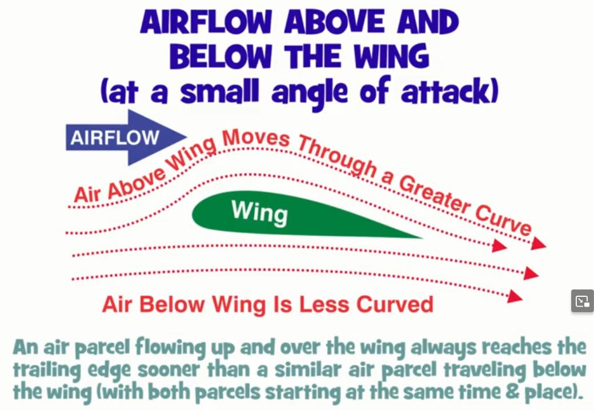{ .img-medium-large .img-center }

## Wing Curvature and Pressure

For example, assume you are walking your pitbull (named Bob) on a leash. You are on the sidewalk and Bob is walking in the gutter. Bob encounters a parked VW and decides to walk over the car rather than around it (remember, it’s a pitbull). Obviously, the distance over the car is greater than the distance you will travel on the sidewalk. In order for Bob to avoid being choked by the leash he will have to speed up slightly as he covers this greater distance. Do you notice the resemblance of the VW’s profile to a wing? It’s curved on top and rather straight on the bottom. As air flows over the wing, it curves and speeds up. Something remarkable happens when air, flowing over a surface, increases its speed. A physicist named Bernoulli, figured out that the faster air flows over a surface the less pressure it exerts on that surface. High velocity airflow results in a slight decrease in pressure on the wing’s upper surface. In other words, the pressure on top of the wing is now less than the pressure on the bottom of the wing (Don’t ask why. It has to do with translation of kinetic energy, and explaining that will give you something that feels like a two scoop lobotomy). Known as Bernoulli’s principle, this wonderful trick is what keeps airplanes from being large and expensive doorstops.

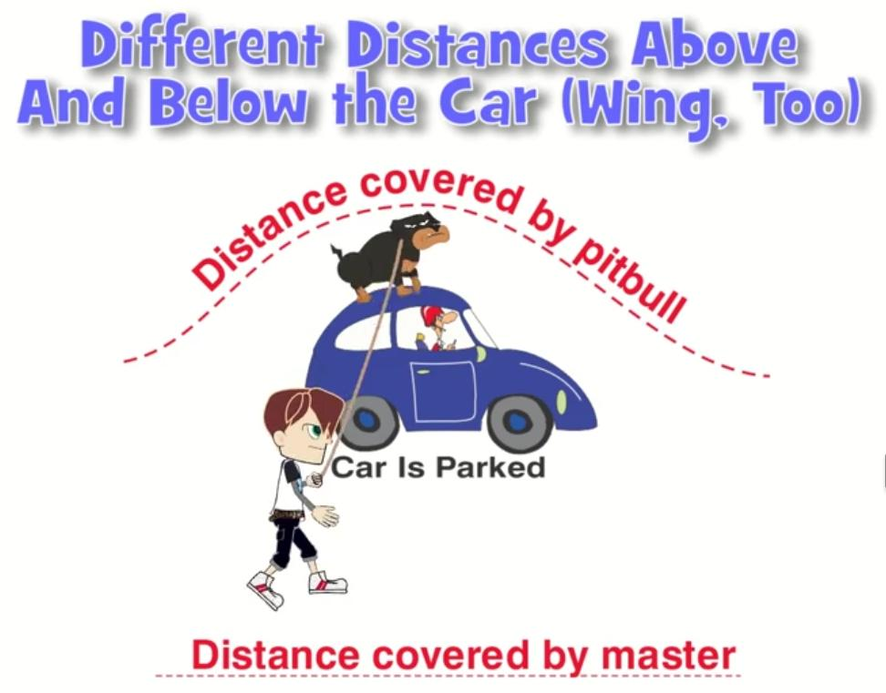{ .img-medium .img-center }

## Bernouilli's Principle

Try an experiment. Take a piece of writing paper and hold it in such a way that the top surface is curved downward. With a little imagination, you can see how the bent paper is similar in appearance to the wing’s upper cambered surface. Now, blow over the top of the paper. What happens? The paper should rise upward. Yes, the velocity of air over a surface results in  lower atmospheric pressure on that surface. This means you have low pressure above the wing and high pressure underneath. Since high pressure always moves toward low pressure, the wing (which just happens to be in the way) is pushed upward in the process. Bernoulli’s principle offers a good explanation for most of the lift developed by the wings of most small airplanes. *Impact or barn door lift* is an accessory. Ultimately, however, it’s Newton’s laws that explain why Bernoulli’s principle works (but this is beyond the scope of this discussion). Most wings are designed with their upper surface curved and their lower surface relatively straight. Because of the wing’s shape, even at a very small angle of attack, a cambered wing still adds a slight curve and acceleration to the wind, and this produces the lift you learn to love, particularly if you think an airplane should fly.

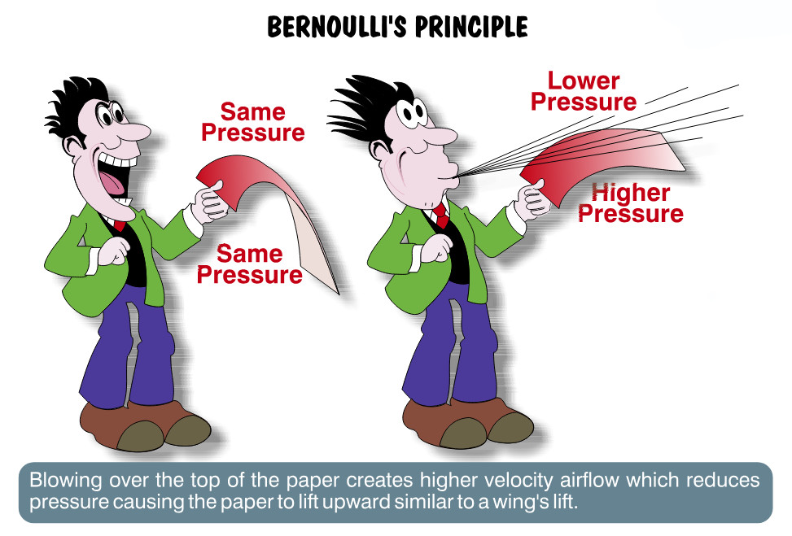{ .img-medium-large .img-center }

## Different Airfoils

There are more wing shapes than there are body shapes at a Weight Watchers convention. Each shape has its own lift and drag characteristics. They all serve one purpose-generating lift. 
Sometimes, however, the engineered shape of the wing all by itself can’t produce the necessary lift for flight. In these cases the angle of attack becomes the major player in lift production.

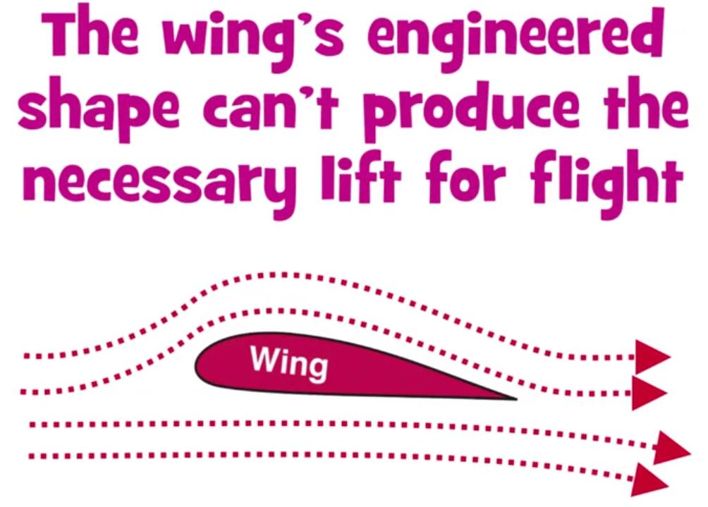{ .img-medium-large .img-inline }
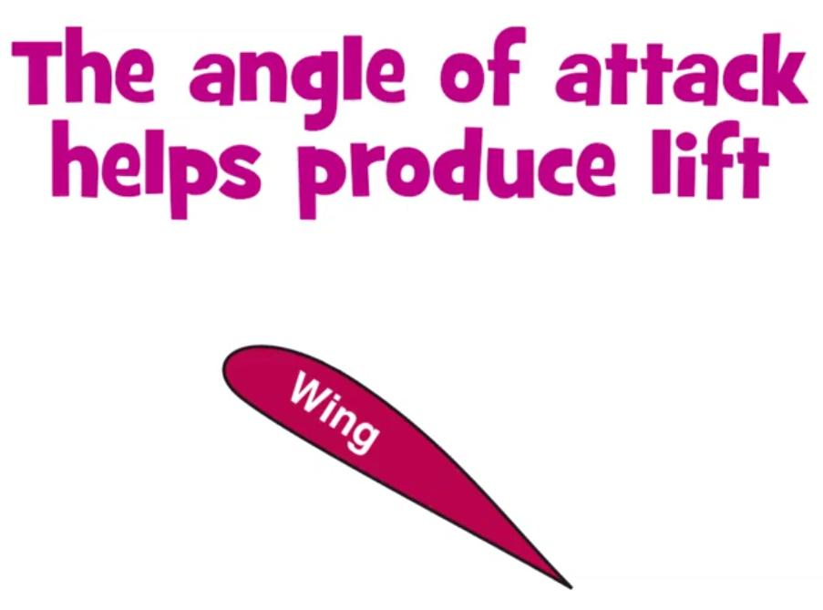{ .img-medium-large .img-inline }

## Angle of Attack And the Generation of Lift

During takeoff on a commercial airliner, have you ever noticed that the pilot always raises the nose slightly to begin the climb after attaining a minimum forward speed? This is called ***rotation*** and it isn’t something done to the airplane’s tires. As the airplane accelerates for takeoff, it eventually reaches a sufficient speed to begin flying. At this relatively slow speed, however, the wing’s engineered curve isn’t capable of curving or deflecting enough air downward to produce the necessary lift for flight. This is why the airplane doesn’t hop off the ground like a grasshopper that just landed on a hot barbecue. The pilot must do something extra to add an additional curve to the wind. ***Raising the nose slightly increases the angle of attack***. This forces the air to undergo an additional curve greater than what the engineered shape of the airfoil can produce.

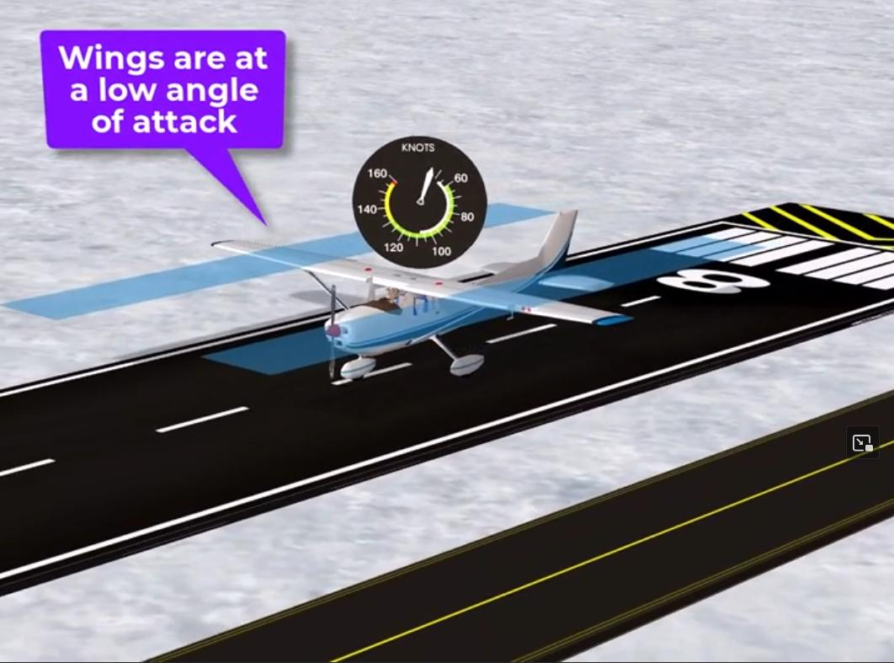{ .img-medium-large .img-inline-3 }
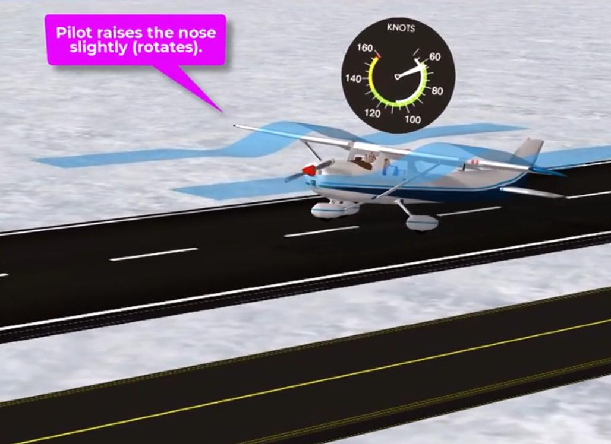{ .img-medium-large .img-inline-3 }
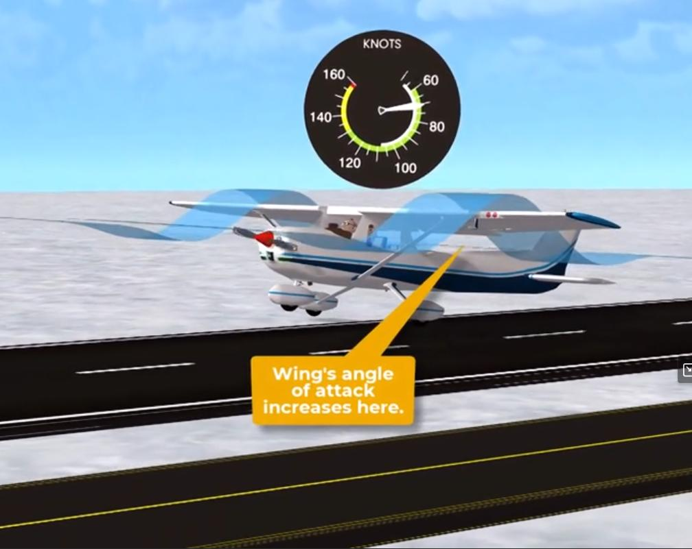{ .img-medium-large .img-inline-3 }

### Two forms of Lift

With this additional curvature, air travels a greater distance, its speed increases, pressure lowers on top of the airfoil, and sufficient lift to begin flying is produced at a slower airspeed (thanks for the lift, Bernoulli!). Greater impact lift results from increased exposure of the wing’s lower surface to the relative wind. The result is that an increasing angle of attack permits the airplane to produce the necessary lift for flight at a slower airspeed. 

Now you know how airfoils generate the required lift at slower airspeeds. You also know why airplanes, taking off or landing at slower speeds, seem to have a rather nose-high attitude. But what happens at higher airspeeds? Have you noticed that in cruise flight, at cruise airspeeds, airplanes fly at near-level flight attitudes? 

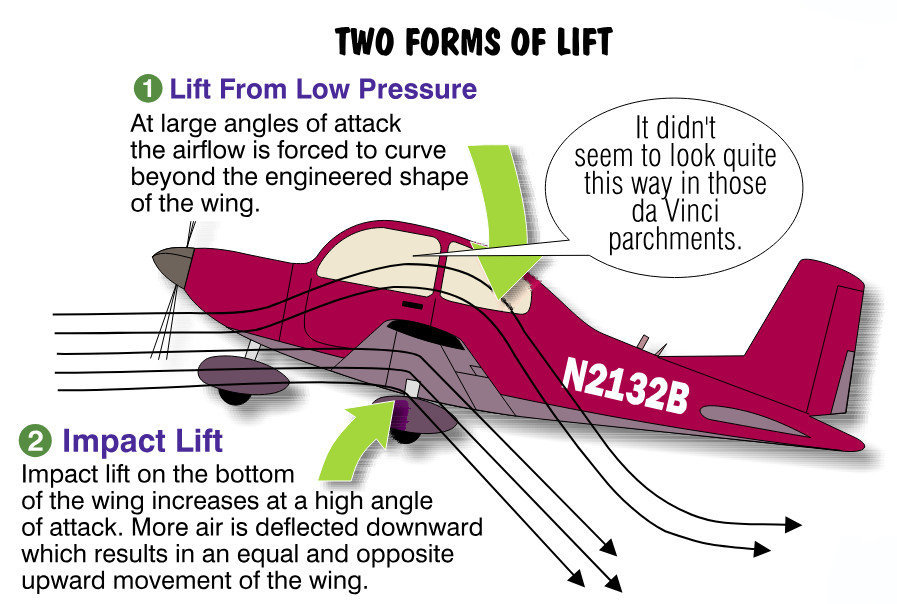{ .img-medium-large .img-center}

## Angle of Attack and Speed

At higher speeds airplanes can fly at lower angles of attack because the wing’s shape generates sufficient lift. Slow the airplane and the wing must artificially bend the wind by increasing its angle of attack. An intimate and sizzling relationship exists between angle of attack and lift. If lift and angle of attack were Rhett and Scarlet, Atlanta wouldn’t be the only thing on fire. At small angles of attack (such as during cruise flight), the engineered shape of the airfoil generates sufficient lift for flight as long the airspeed is high. The impact of air underneath the wing doesn’t play as big a role in lift development at higher (cruise) speeds because less of the wing’s underside is exposed to the wind. In summary, the slower an airplane moves, the greater the angle of attack needed for flight. There is, however, such a thing as too much of a good thing. Bend the air too much and instead of flowing smoothly over the wing and creating lift, it bubbles and burbles and pretty much fails to be very uplifting. We call this condition a ***stall***. What kind of instructor would I be if I didn’t say, “Let’s find out how and why a wing stalls”?

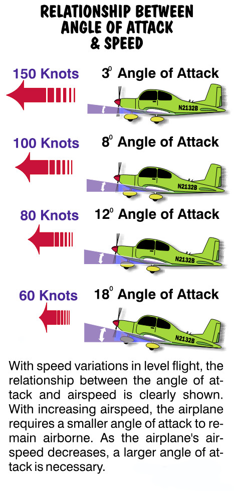{ .img-medium .img-center}

## The Lift Equation

Much like a cake recipe, the lift produced by the wings results from several ingredients (although you shouldn’t put “icing” on your wing). Lift is a product of the wings’:

* coefficient of lift;
* surface area, and
* the dynamic air pressure on the wing (otherwise known as the product of one-half of the air density times the velocity squared).

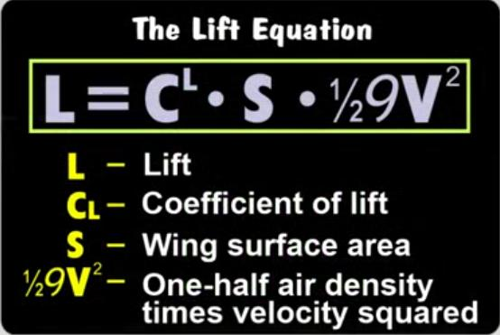{ .img-medium .img-center}

Now, said another way, if you increase the wing's surface area the amount of air blowing on it, the density of the air blowing on the wing or the angle of attack (which is the coeficient of Lift),  
you increase the overall Lift production. These values should be somewhat familiar to you by now, with the possible exception of the coefficient of lift, otherwise referred to as CL. To understand the coefficient of lift, we need to see how it’s derived.  The coefficient of lift is an experimentally derived value, which means that an experiment must be done to derive it. So get that lab coat on and let’s break some beakers. 

We’ll begin with a wing or wing section having a known surface area and place it in a wind tunnel, (all pilots of course have a wind tunnel in their garage, right? Well, maybe not.). Air at a specific density and velocity blows over the wing while its angle of attack is increased in increments. A device similar to a scale measures the lift produced by that wing segment at each incremental increase in angle of attack. The resulting lift produced by that wing or wing segment along with the other values of wing area, air density and air speed are placed back into the lift equation. The only value of the lift equation that is not yet known is the ***coefficient of lift***.

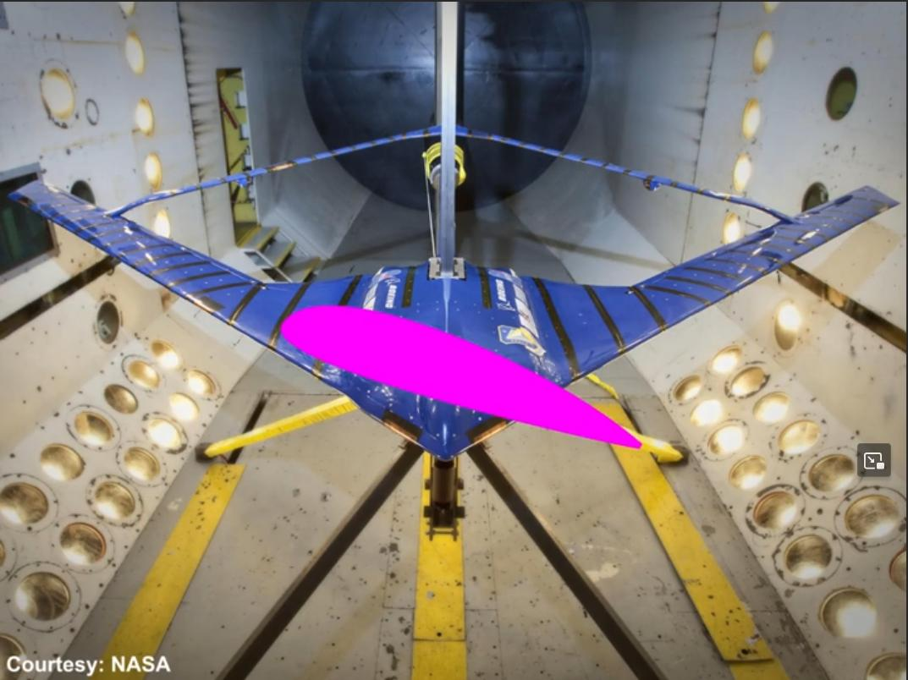{ .img-medium-large .img-inline }
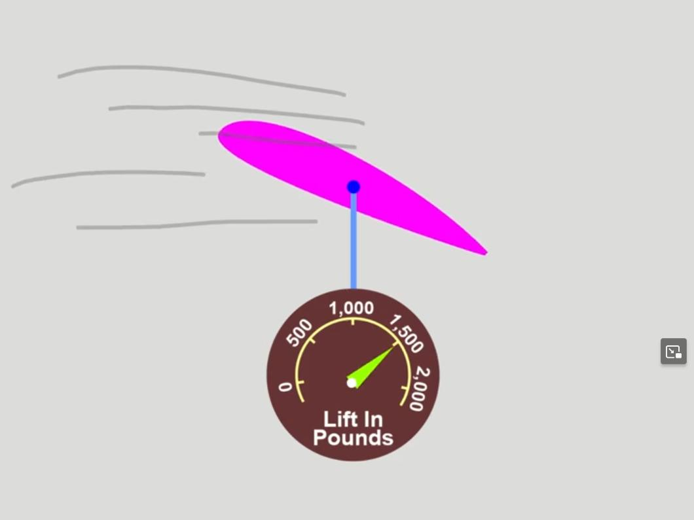{ .img-medium-large .img-inline }
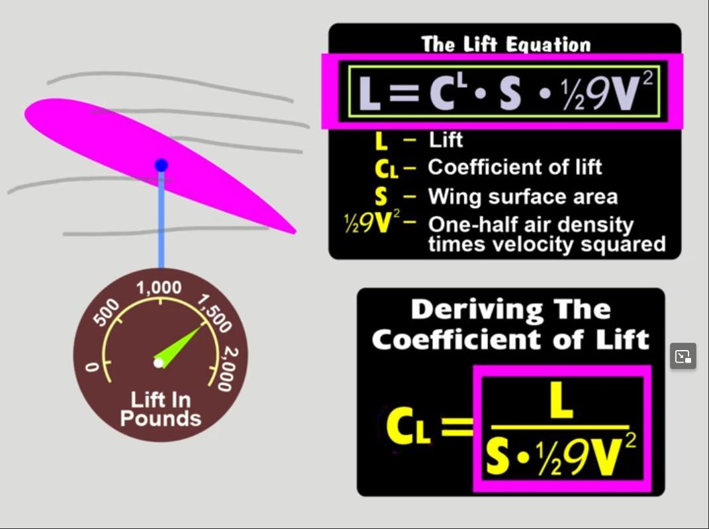{ .img-medium-large .img-center }

Now you use your high school math skills (which doesn’t mean paying a smart guy to give you the answer either) You use this skills to isolate the coefficient of lift variable to one side of the lift equation. Insert the previously measured values from the wind tunnel into the variables on the right side of the equation, and quicker than you can say, “Einstein,” out pops a coefficient of lift for each angle of attack value. When you move all the values (except for the coefficient of lift) to the one side of the equal sign, the units of those values (pounds, feet per second, etc.) cancel each other out. It’s like getting your car washed and waxed—all that’s left is the shine, or in this case, a numerical value that has no units. The coefficient of lift is a unit-less number, but one that has great usefulness. 

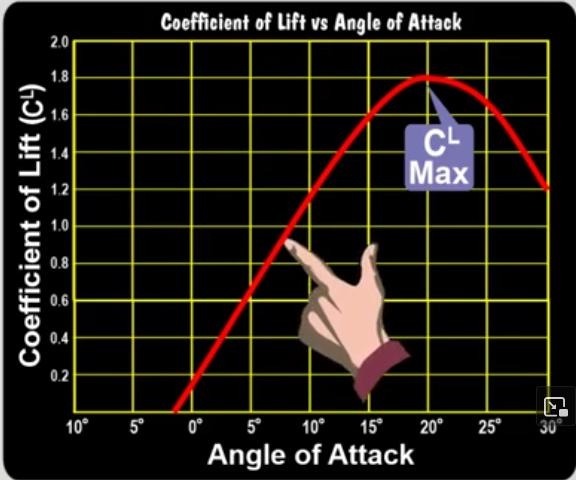{ .img-medium-large .img-center }

Looking at the coefficient of lift on a graph, you can see that there appears to be a linear (straight line) relationship between the angle of attack and the coefficient of lift. Double the CL and you double the lift, reduce the CL by one-half and you reduce the lift by one half. The most important thing to observe on the CL vs. Angle of Attack graph is that the CL increases as the angle of attack increases, but only up to a point called ***CLmax*** and by now you have undoubtedly leaped or flown to the conclusion. Correctly, of course. That this is the critical angle of attack. A further increase in angle of attack decreases the production of lift, and the only way to get that lift back is to decrease the angle of attack to less than CLmax. That’s the takeaway point about this point. The typical angle of attack associated with CLmax is about 18 degrees for most small airplanes. This can and does vary a bit based on the size and shapes of the wings on those aicraft. One thing, however, is certain, and that is wings stall when they exceed their critical angle of attack, and the only way to recover from a ***stall*** is to reduce the angle of attack.

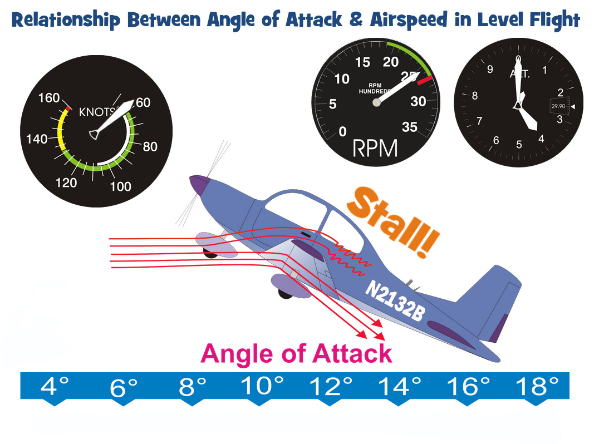{ .img-medium-large .img-center }