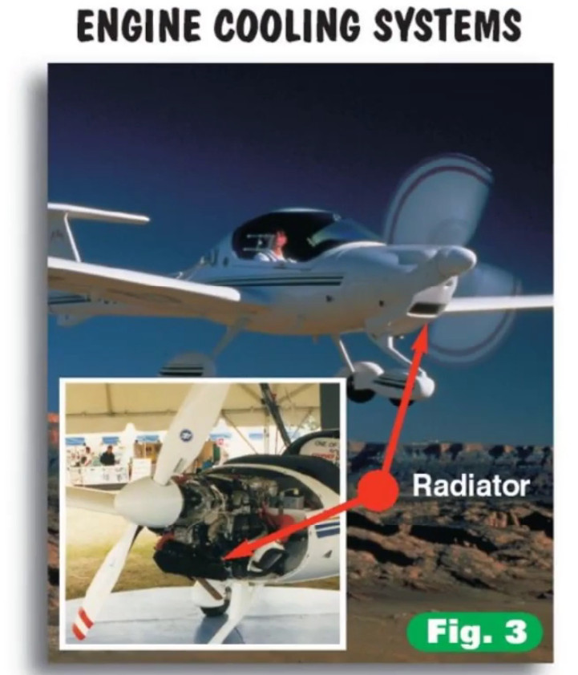
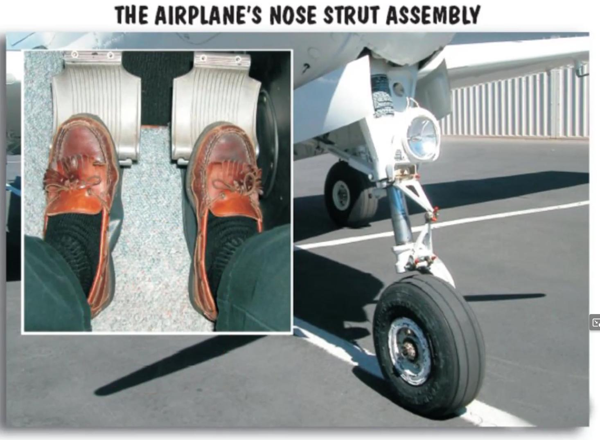
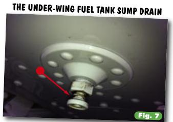
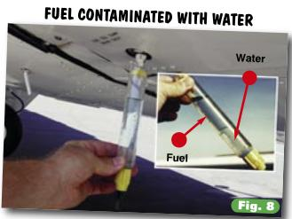

# Airplane Components

## Getting to Know Your Airplane

Let me take you on a short tour of a few typical general aviation airplanes. (General aviation is the term often used for “private” flying.) I want you to become familiar with the basic parts of these airplanes, and the common terminology you’re likely to encounter at the airport and in the cockpit.

Before starting the tour, let me say that while almost everything I’ll point out can be found on almost every airplane you’re likely to fly, there are always exceptions. Be flexible (the wings are).

Airplanes are like people (sort of). They come in all sizes, shapes, and colors. But looks really can be deceiving. Airplanes are more similar than they are different. 

Think of an airplane as a cigar with two Hershey bars on the sides, a propeller beanie cap on the front, and a tail at the back and you’ll have the general picture. The rest of this is just details. 

## In the Beginning 

Let’s begin at the beginning, with the **propeller**. Most general aviation airplanes have propellers of some shape or form. When spun by the engine, the propeller produces thrust, which propels (as in propeller) the airplane forward. Atop the prop sits the spinner, a generally cone-shaped piece of metal which deflects air slightly, encouraging it to enter the engine cowling where it helps cool the engine. Engines are by nature hotheads, and most airplane engines typically depend on air (rather than water, as in your car) to keep their cool. Some airplanes do use water for engine cooling. The Katana is a good example.

Look down at the feet. Not yours, the airplane’s. If it’s like most modern general aviation airplanes, your aircraft has three rubber feet attached to sort of spindly legs. This is referred to as a tricycle gear, and has nothing to do with your need for trainer wheels. The front foot is the nose gear. The long, leggy thing above the nose gear rubber tire is the strut  (or oleo), a piston within a cylinder. It acts to absorb the abrupt bounces you encounter while shuttling to and from the runway, as well as the shock of being dropped to the ground after landing.

The nose strut’s major function is to help steer the airplane on the ground, which you accomplish by applying pressure on the bottom  part of a rudder pedal  inside the cockpit (the top part of the rudder pedal is generally the brakes). That’s right, you steer an airplane that’s on the ground with your feet. We instructors get a nostalgic kick out of watching first time students taxi an airplane (maneuver it on the ground). Who doesn’t remember frantically whipping the control wheel back and forth in utter amazement as nothing happens? During my first taxi attempt I remember looking at my instructor like I looked at the DMV lady when she asked if I wanted to donate any of my organs (not realizing she meant after the accident). This demonstration, more than anything else, disabuses the pilot novitiate of the idea that learning to fly is just like learning to drive a car (it isn’t).

{ .img-medium .img-center }

Please note that you do not (intentionally, at least) ever land on the nose gear. When your instructor asks how many landing gear an airplane has, he or she doesn’t mean to imply that you land on all three at the same time. You land on the two main gear, then (gently, we hope) lower the nose gear. 

Though it may do a good turn for you on the ground, once airborne the airplane’s nose gear extends fully and locks in a centered position, something like an army private standing at attention during inspection. Step on the rudder pedal in flight (top or bottom) and you will move the rudder, at the rear of the plane. The nose gear knows it’s not needed now. The strut compresses on landing, and the nose gear is once again free to turn, turn, turn.

Some airplanes don’t have a rudder-controlled nose gear assembly (see, I told you there were exceptions). Instead, they have a castering (swiveling type) nose gear. Applying either the right or left main gear brake (gently, please) sets the plane to pivoting about one of its main wheels, turning it the way Nureyev would turn a ballerina. Once airborne, aerodynamic pressure centers the castering nose gear.

The other two feet on an airplane are the main gear. These are either fixed (“down and welded” in pilotspeak), or retractable. A fixed gear causes drag in flight, which slows an airplane, but it’s simple, reliable, inexpensive to maintain, and is always there when you need it. A retractable gear plane is more efficient because the gear is tucked up, reducing drag and allowing it to fly faster for a given amount of power. The pilot, however, is responsible for remembering to put the gear back down again before landing. Forget to put it down and the gear will not  be there when you need it. This is very hard on the underside of the airplane, the runway, the passengers, and your pocketbook. Retractable gear also need more maintenance. This can be expensive over the long haul.

## Wing a Ding

While you’re crawling around down there, look up. The large things casting a big shadow are the wings. These are generally considered important because they make the airplane fly. For now, it’s enough to know that there should be two of them (one on each side of the plane, preferably).

Under each wing on most airplanes is a fuel tank sump drain. Water and gunk of various sorts can invade the fuel system, and it must be drained before flight. (Water and gunk are put in the fuel by fuel fairies, trolls, and other things mere mortals can’t see.) Using a **fuel strainer**, you tap each sump or drain site and examine what comes out for the presence of anything that shouldn’t be there.

{ .img-medium .img-center }{ .img-medium .img-center }

Under the left wing of most airplanes, where it can poke a tall pilot in the nose, is the pitot tube. That’s pee-toe, not pilot. Now you know one word of French, and speak it like a native. The pitot tube takes in moving air, which is mechanically converted into an airspeed reading and displayed on a dial in the cockpit. I’ll tell you how that happens later. Pitot tubes are usually encased in electric heating elements, which help prevent ice formation. As you will see, the opening on a pitot tube isn’t very large; even a little bit of ice or a kamikaze fly would shut down operations, and without the pitot source, you wouldn’t have an airspeed indication on your airspeed indicator. Pitot heat is turned on and off via a switch (one of many) in the cockpit.

Not satisfied just to sample moving air, we also have a static source. This is not where you get static electricity when you want to make your instructor’s hair stand on end (you’ll learn lots of other ways to do that). The static source provides information about the outside air pressure. This information is used by several instruments, including the altimeter, vertical speed indicator and the airspeed indicator (which computes airspeed by mechanically subtracting static pressure from pitot pressure). Sometimes the static source is located directly behind and below the opening on a different variety of pitot tube. No matter where they are, the openings for the pitot and static sources must be free of any foreign matter (bugs, dirt, bubble gum, etc.).

## Stop Stalling

Most airplanes have a device to warn of an impending stall. (In aviation, the word stall means the wings have stopped flying, as opposed to an engine that won’t start. The first type of ***stall warning device*** is the suction type, and the second is the electric type. Get the plane headed for a stall, and the warning horn will bawl.

The suction type works because a slight vacuum forms as air flows over it in an approaching stall. This sets off the horn. The electric version works because two metal contacts come into contact as the plane gets into an unhappy configuration. This closes a circuit, sounding a horn in the cockpit. Either way, you’ll hear about it if a stall is imminent.

On top of the wing, you will find ***fuel tank caps*** They don’t jump around a lot, but they do keep the fuel in the tank, which is useful. Inside the tank you will sometimes see a marking tab, used to visually calibrate the tank’s fuel quantity. Some caps are vented-they have an opening for air to enter and exit. If the tank were tightly sealed, as fuel was used in flight a vacuum would form in the tank, and eventually fuel flow would be restricted or might even stop. Not good. Instead of vented caps, some airplanes allow air into or out of the tank via tank vent lines.

There are three ***navigation lights*** on the airplane. Just as prairie dogs aren’t really dogs, navigation lights don’t actually help the pilot navigate. Each is a different color, and each has its assigned place. The one on the left wingtip is always red, the one on the right wingtip is always green, and the one atop the tail is always white. At night, this enables other pilots to know whether you’re coming or going, since the plane itself is not visible. (There is, unfortunately, no device to tell the pilot whether he or she is coming or going. You have to figure it out for yourself.) An optical light sensor is sometimes placed on the wingtip, to let the pilot know if the navigation light is working. The rules require a plane’s navigation lights to be illuminated any time the plane is moving between sunset and sunrise.

There are usually ***strobe lights*** on the wingtips (and sometimes the tail, as well). These powerful, flashing lights can be seen from a great distance, especially at night, and help alert others to your presence. This is necessary because screaming out the window does not work.

## Moving Parts

The ***ailerons*** are the moveable, flap-like appendages found along the outer part of the wing’s trailing edge. You will note that as one aileron moves up, the other moves down. Yin and yang, cosmic balance, and the ability to turn the airplane all stem from this. Ailerons make slight changes in the lift developed by each wing, causing the airplane to bank and turn. A downward-moving aileron increases the wing’s lift, and an upward-moving aileron decreases the wing’s lift. Turning the control wheel (right or left) deflects the ailerons in the appropriate direction for a turn.

***Flaps*** allow the airplane to develop the lift needed for flight at slow speeds, such as when landing. When deflected, flaps change the wing’s curvature, and in some cases increase its surface area. An increase in curvature and surface area means the wing produces more lift, as well as more drag.

The ***fuselage*** is the big piece in the middle (the cigar) to which everything else (wings, engine, etc.) is bolted. The ***empennage*** is the tail feathers, the aft part of the airplane.

## Staying Stable

The empennage is home to the ***vertical and horizontal stabilizers***. The horizontal version has a moveable surface ***(the elevator)***  connected to it. Forward or aft movement of the control wheel (or control stick) in the cockpit deflects the elevator. This changes the lift produced by the horizontal portion of the tail and points the airplane’s nose up or down. It’s the elevator control that allows you to select the attitudes (the plane’s attitude, not yours) needed for takeoff, climb, cruising flight, and descents.

Moving onward and upward, we see the ***vertical stabilizer*** . It, too, has a moveable appendage the ***rudder***,which you may recall is controlled by the rudder pedals beneath the pilot’s feet. Application of right or left rudder changes the lift produced by the vertical portion of the tail and swings the nose to the left or right. This allows the pilot to point the nose of the airplane in the appropriate direction of turn (As you will soon learn, the airplane’s nose doesn’t always want to point in the direction the pilot wants to go.)

Most elevator surfaces have a small, moveable appendage called the ***trim tab***. Turning the trim wheel in the cockpit moves the trim tab, which accomplishes aerodynamically what the pilot would otherwise have to do through brute force in order to maintain a desired pitch attitude.

## Antenna Farm Deluxe

Airplanes, like police cruisers, are virtual antenna farms. Atop the tail you will probably see two ***VOR antennas***. VOR stands for very high frequency omnidirectional range, a navigation system that depends on receiving signals from ground stations. A variety of other antennas, usually mounted on top of the fuselage, permit communication with controllers on the ground and with other aircraft.

## Back Up Front

  Let’s get back to where we began, the front of the airplane, where you will find (I hope) the ***engine cowling***. Some airplanes have engine cowlings that can be easily opened for inspection before every flight. Unfortunately, many modern general aviation airplanes have only a small pop-open door through which you try to peer to see if everything under the hood is good. It’s through this door that you generally check for adequate engine oil (using a dipstick much like that of a car), and drain a sample of fuel from the lowest engine point to check for contamination before taking to the air. 

  Checking the fuel is a simple procedure. You pull on the lever usually adjacent to a deepstick, which actiavtes a ***quick drain valve***. Fuel drains onto the asphalt although you should try to capture it in a sampling container. This makes it easier to detect the presence of water. Some airplanes have a different version of a fuel strainer. These airplanes allow the sampling of the fuel strainer’s contents by a valve located on the outside of the cowling. Most small general aviation airplanes have three drain valves (one for each of the two fuel tanks, and one for the fuel strainer) while more complex aircraft have five or more drains. 

  Entering the cockpit (a.k.a. “the front office”) you will see a wide (actually, bewildering) array of instrumentation. Each instrument or item has a specific name and serves an important purpose (this includes the plastic cup holders, if your airplane is so equipped). Before long you will become intimately familiar with each item. It may look overwhelming at first, but within a few hours of starting to fly you will be right at home with all these tools of the trade. Then you can bring your friends out and dazzle them with your knowledge. This is part of the thrill of aviation.

  Now that we’ve become somewhat familiar with the airplane and its components, it’s time to take a look at what makes an airplane fly. The science of aerodynamics is fundamental to the safe operation of any airplane. Since safe operation is really the only kind that makes a whole lot of sense when you’re talking about airplanes, let’s find out what’s keeping you up in the air.

